## Introduction

1) The class will include 5 sessions: 
  + Session 1  (9-10:30): Data Types in R 
  + Session 2  (10:45-12:30): Control Structures, Functions, and Statistical Distributions in R
  + Lunch (12:30 - 1)
  + Exercise 1 (1-1:30): Basic Data Exploration
  + Session 3  (1:30-3): Statistical Analysis in R 
  + Session 4  (3:15-4): Plotting and Data Visualization in R
  + Exercise 2 (4:15-5:00): Data visualization & Statistical Analysis
  

---


## Introduction

2) We are going to work in pairs. Please find a partner. 

3) Feel free to ask questions anytime during lectures.

4) To access this presentation and the codes used during the workshop please visit:
  + http://ucidatascienceinitiative.github.io/IntroR_Workshop/#1


---

## Session 1 - Agenda

1. RStudio
2. Data Types in R
3. Subsetting in R

---

## What is R?

+ R is a free software environment for statistical computing and graphics
  + See http://www.r-project.org/ for more info
  
  
+ R compiles and runs on a wide variety of UNIX platforms, Windows and Mac OS

+ R is Open-Source and free

+ R is fundamentally a command-driven system

+ R is an object-oriented programming language 
  + everything in R is considered as an object!


--- 


## R Studio:

1. RStudio is a free and open source integrated development environment (IDE) for R.

2. To download RStudio please visit: http://rstudio.org/

3. Please note that you must have R already installed before installing R Studio.

---

## Data Types in R:

1. R has 5 main atomic data types:
  + Numeric
  + Integer
  + Complex
  + Logical
  + Character
  
2. Everything in R is object. Objects can have some attributes.
  + names, dimension, length are some possible attributes

---

## Vectors in R:

Vector is the most basic object in R


```r
numVec <- 1:10 # <- : is assigning operator
numVec
```

```
##  [1]  1  2  3  4  5  6  7  8  9 10
```

```r
charVec <- c("a", "b", "c") # c: to combine elements
charVec
```

```
## [1] "a" "b" "c"
```

```r
logVec <- vector(mode = "logical", length = 10)
logVec
```

```
##  [1] FALSE FALSE FALSE FALSE FALSE FALSE FALSE FALSE FALSE FALSE
```

---

### Special Values:

There are some special values in R:
  + use L to refer to an integer value: 1L
  + R knows infinity: Inf, -Inf
  + NaN: refers to "Not a number"
  

```r
intVec <- c(1L, 2L, 3L, 4L) 
intVec
```

```
## [1] 1 2 3 4
```

```r
a <- Inf; b <- 0
rslt <- c(b/a, a/a)
rslt
```

```
## [1]   0 NaN
```

---

### Logical, Complex, & Character Vectors:

Let's see some examples of logical, complex, and character vectors:

```r
logVec <- c(TRUE, FALSE, FALSE, T, F)
logVec
```

```
## [1]  TRUE FALSE FALSE  TRUE FALSE
```

```r
compVec <- c(1 + 0i, 3 + 1i)
compVec
```

```
## [1] 1+0i 3+1i
```

```r
charVec <- c("red", "green", "blue")
charVec
```

```
## [1] "red"   "green" "blue"
```

---

### Data Type Coercion:

+ In general, vectors CAN NOT have mixed types of objects
+ exception: lists in R 


```r
numCharVec <- c(3.14, "a")
numCharVec # ? what would you expect to be printed?

numLogVec <- c(pi, T)
numLogVec # any guess?

charLogVec <- c("a", TRUE)
charLogVec # ?
```

+ In examples above, we saw implicit coercion 
+ Explicit coercion is also possible!

---

### Data Type Coercion:

+ as(): To explicitly coerce objects from one type to another


```r
numVec <- seq(from = 1200, to = 1300, by = 15)
numVec
```

```
## [1] 1200 1215 1230 1245 1260 1275 1290
```

```r
numToChar <- as(numVec, "character")
numToChar
```

```
## [1] "1200" "1215" "1230" "1245" "1260" "1275" "1290"
```

```r
logVec <- c(F, T, F, T, T)
as(logVec, "numeric")
```

```
## [1] 0 1 0 1 1
```

---

### Data Type Coercion:

+ Coercion does not always work! Be careful about warnings:


```r
compVec <- c(12+10i, 1+6i, -3-2i)
as(compVec, "numeric")
```

```
## Warning: imaginary parts discarded in coercion
```

```
## [1] 12  1 -3
```

```r
charVec <- c("2.5", "3", "2.8", "1.5", "zero")
as(charVec, "numeric")
```

```
## Warning: NAs introduced by coercion
```

```
## [1] 2.5 3.0 2.8 1.5  NA
```

---

### Factors:

+ Factor is a vector object used to specify a discrete classification (categorical values).
+ Factors can be: 1) ordered, 2) un-ordered
+ Levels of a Factor are better to be labeled (self-descriptive)
  + Consider gender as (0, 1) as opposed to labeled ("F", "M")

```r
Gender <- rep(c("Female", "Male"), times = 3)
Gender
```

```
## [1] "Female" "Male"   "Female" "Male"   "Female" "Male"
```

```r
GenderFac1 <- factor(Gender)
GenderFac1
```

```
## [1] Female Male   Female Male   Female Male  
## Levels: Female Male
```

---

### Factors:


```r
levels(GenderFac1)
```

```
## [1] "Female" "Male"
```

```r
table(GenderFac1)
```

```
## GenderFac1
## Female   Male 
##      3      3
```

```r
unclass(GenderFac1) # bring the factor down to integer values
```

```
## [1] 1 2 1 2 1 2
## attr(,"levels")
## [1] "Female" "Male"
```

---

### Factors:

```r
GenderFac1 # levels are ordered alphabetically - 1st level = BaseLevel
```

```
## [1] Female Male   Female Male   Female Male  
## Levels: Female Male
```

```r
GenderFac2 <- factor(Gender, levels = c("Male", "Female"))
GenderFac1
```

```
## [1] Female Male   Female Male   Female Male  
## Levels: Female Male
```

```r
GenderFac2
```

```
## [1] Female Male   Female Male   Female Male  
## Levels: Male Female
```

---

### Missing Values:

+ There are two kinds of missing values in R:
  + NaN: refers to "Not a Number" and is a a missing value produced by numerical computation.
  + NA: When a value is "Not Available" or is "Missing", NA is assigned as its value.

+ NaN is also considered as NA (the reverse is NOT true). 

```r
testScore <- NA
is.na(testScore)
```

```
## [1] TRUE
```

```r
is.nan(testScore)
```

```
## [1] FALSE
```

---

### Matrices:

+ Matrix is a special case of vector:
  + Matrix has dimension attribute


```r
myMat <- matrix(nrow = 2, ncol = 4)
myMat
```

```
##      [,1] [,2] [,3] [,4]
## [1,]   NA   NA   NA   NA
## [2,]   NA   NA   NA   NA
```

```r
attributes(myMat)
```

```
## $dim
## [1] 2 4
```

---

### Matrices:

```r
myMat <- matrix(1:8, nrow = 2, ncol = 4)
myMat # matrices are filled in column-wise
```

```
##      [,1] [,2] [,3] [,4]
## [1,]    1    3    5    7
## [2,]    2    4    6    8
```

---

### Matrix is a special vector:


```r
myVec <- 1:8
myVec
```

```
## [1] 1 2 3 4 5 6 7 8
```

```r
dim(myVec) <- c(2,4)
myVec
```

```
##      [,1] [,2] [,3] [,4]
## [1,]    1    3    5    7
## [2,]    2    4    6    8
```

+ Similar to vectors, all elements of a matrix should have the same type.
  + if not, R does an automatic coercion.

---

### Other Ways to Create Matrix:

+ As it's intuitive, matrices seem to be a combination of vectors that are put next to each other (either column wise or row wise).

+ rbind() (row bind) and cbind (column bind) do a similar job:

```r
vec1 <- 1:4
vec2 <- sample(1:100, 4, replace = FALSE)
vec3 <- rnorm(4, mean = 0, sd = 1)
colMat <- cbind(vec1, vec2, vec3)
colMat
```

```
##      vec1 vec2     vec3
## [1,]    1   88 -0.60388
## [2,]    2   64 -0.07985
## [3,]    3   74  0.89368
## [4,]    4   55  1.85324
```

---

### Other Ways to Create Matrix:


```r
vec1 <- 1:4
vec2 <- sample(1:100, 4, replace = FALSE)
vec3 <- rnorm(4, mean = 0, sd = 1)
rowMat <- rbind(vec1, vec2, vec3)
rowMat
```

```
##         [,1]    [,2]   [,3] [,4]
## vec1  1.0000  2.0000  3.000 4.00
## vec2 21.0000 62.0000 74.000 9.00
## vec3  0.6717  0.1932 -2.489 1.09
```

---

## Lists:

+ Consider list as a vector but with two main differences:
  + each element of a list can have its own class regardless of other elements
  + This means, each element can be of a different data type and a different length

```r
myVec <- c(10, "R", 10-5i, T)
myList <- list(10, "R", 10-5i, T)
myVec
```

```
## [1] "10"    "R"     "10-5i" "TRUE"
```

---

## Lists:


```r
myList <- list(10, "R", 10-5i, T)
myList
```

```
## [[1]]
## [1] 10
## 
## [[2]]
## [1] "R"
## 
## [[3]]
## [1] 10-5i
## 
## [[4]]
## [1] TRUE
```
+ Elements of list are shown with [[]]
+ Elements of vector are shown with []

---

## Data Frames:

+ We use data frames to store tabular data
+ Data frame is a special list where all objects have equal length
+ The main difference between data.frame and Matrix?

```r
studentID <- paste("S#", sample(c(6473:7392), 10), sep = "")
score <- sample(c(0:100), 10)
gender <- sample(c("female", "male"), 10, replace = TRUE)
data <- data.frame(studentID = studentID, score = score, gender = gender)
head(data)
```

```
##   studentID score gender
## 1    S#7075    74 female
## 2    S#6834    68 female
## 3    S#7282    10   male
## 4    S#6903    18 female
## 5    S#7067    98   male
## 6    S#7026     7   male
```

---

## Subsetting:

+ Often times we need to take a subset of a vector, a matrix, a list, or a dataframe.
+ We consider three main operators to take a subset of an object:
  + [ ]: single brackets return an object of the same class of the original object. By using [], we can also choose more than one element.
  + [[ ]]: double brackets are used primarily for lists and dataframes. 
  + "$": is used primarily for lists and dataframes (similar to double brackets). 

+ With [[ ]] and $, we can only choose one object!

+ [[ ]] and $ can return an object with a different class than the original objects we are subsetting from.

---

### Subsetting examples:


```r
myVec <- 10:20
myVec[3]
```

```
## [1] 12
```

```r
myList <- list(obj1 = "a", obj2 = 10, obj3 = T, obj4 = 10-5i)
myList[[3]]
```

```
## [1] TRUE
```

```r
myList$obj3
```

```
## [1] TRUE
```

---

## Subsetting with [ ]:

+ By using single bracket, we can choose more than one element of an object.
+ In this case, index vectors can be very useful:
  + Index vector is a vector of indices of another vector that is used to select a subset of another vector (or Matrix)
  

```r
x <- seq(from=0, to=100,by=10) # length(x) is ??
IndVec <- c(1, 2, 3, 4, 5) # the first 5 elements 
x[IndVec]
```

```
## [1]  0 10 20 30 40
```

---

## Index Vectors:

+ There are four types of Index vectors:
  1. Logical Index Vector: The logical index vector should be of the same length of the vector from which we are selecting a subset. Values corresponding to TRUE in the index vector are selected.
  2. Vector of Positive integers: All the values in this type of index vector must lie in 1:(length(x)).
  3. Vector of Negative integers: This type of index vector indicates the values to be excluded from the
vector.
  4. A Vector of Character Strings: if a vector has a name attribute, we can simply take a subset of the vector by calling the names of the elements.

---

## Index Vectors:

```r
myVec <- letters[1:10]
names(myVec) <- paste("e", 1:10, sep = "")
myVec
```

```
##  e1  e2  e3  e4  e5  e6  e7  e8  e9 e10 
## "a" "b" "c" "d" "e" "f" "g" "h" "i" "j"
```

```r
logIndVec <- rep(c(T, F), each = 5)
logIndVec
```

```
##  [1]  TRUE  TRUE  TRUE  TRUE  TRUE FALSE FALSE FALSE FALSE FALSE
```

```r
posIndVec <- 1:5
negIndVec <- -6:-10
chIndVec <- c("e1", "e2", "e3", "e4", "e5")
```

---

## Index Vectors:

```r
myVec[logIndVec]
```

```
##  e1  e2  e3  e4  e5 
## "a" "b" "c" "d" "e"
```

```r
myVec[negIndVec]
```

```
##  e1  e2  e3  e4  e5 
## "a" "b" "c" "d" "e"
```

```r
myVec[chIndVec]
```

```
##  e1  e2  e3  e4  e5 
## "a" "b" "c" "d" "e"
```

---

## Logical Index Vectors:

+ logical index vectors can be generated by using conditional statements:
  + Using ==, !=, <, >, ...


```r
myVec <- 1:10
logIndVec <- (myVec < 5)
logIndVec
```

```
##  [1]  TRUE  TRUE  TRUE  TRUE FALSE FALSE FALSE FALSE FALSE FALSE
```

```r
myVec[logIndVec]
```

```
## [1] 1 2 3 4
```

---

## Matrix Indexing:
+ Similar to vector indexing, we can refer to individual elements of a matrix.

```r
myMat <- matrix(1:8, ncol = 4)
myMat
```

```
##      [,1] [,2] [,3] [,4]
## [1,]    1    3    5    7
## [2,]    2    4    6    8
```

```r
myMat[1,1] # refering to an element
```

```
## [1] 1
```

```r
myMat[2,] # refering to the second row
```

```
## [1] 2 4 6 8
```

```r
myMat[,3] # refering to the third column
```

```
## [1] 5 6
```

---

## Matrix Indexing:

+ By default, when the retrieved elements of a matrix look like a vector, R drops their dimension attribute. We can turn this feature off by setting drop = FALSE


```r
myMat[1,1]
```

```
## [1] 1
```

```r
myMat[1,1, drop = FALSE]
```

```
##      [,1]
## [1,]    1
```

```r
myMat[2,, drop = FALSE]
```

```
##      [,1] [,2] [,3] [,4]
## [1,]    2    4    6    8
```

---

## Subsetting Lists:

```r
myList <- list(ch = letters[1:2], lg = F, nm = 1:3)
myList
```

```
## $ch
## [1] "a" "b"
## 
## $lg
## [1] FALSE
## 
## $nm
## [1] 1 2 3
```

```r
myList[1] # subset is still a list
```

```
## $ch
## [1] "a" "b"
```

---

## Subsetting Lists:

```r
myList[1:2] # subset is still a list
```

```
## $ch
## [1] "a" "b"
## 
## $lg
## [1] FALSE
```

```r
myList[[1]] # returning the 1st obj with its own class
```

```
## [1] "a" "b"
```

```r
myList$ch # alternative to [[]]
```

```
## [1] "a" "b"
```

---

## Subsetting Lists:

```r
myList[[1]][2] # returning the 2nd element of the 1st obj
```

```
## [1] "b"
```

```r
myList$ch[2]
```

```
## [1] "b"
```

```r
myList[[c(1,2)]]
```

```
## [1] "b"
```

---

## Subsetting Data Frames:

```r
library(datasets)
data(quakes) # ?quakes for more info
str(quakes)
```

```
## 'data.frame':	1000 obs. of  5 variables:
##  $ lat     : num  -20.4 -20.6 -26 -18 -20.4 ...
##  $ long    : num  182 181 184 182 182 ...
##  $ depth   : int  562 650 42 626 649 195 82 194 211 622 ...
##  $ mag     : num  4.8 4.2 5.4 4.1 4 4 4.8 4.4 4.7 4.3 ...
##  $ stations: int  41 15 43 19 11 12 43 15 35 19 ...
```

```r
head(quakes$long)
```

```
## [1] 181.6 181.0 184.1 181.7 182.0 184.3
```

---

## Subsetting Data Frames:


```r
quakes[1:10,]
```

```
##       lat  long depth mag stations
## 1  -20.42 181.6   562 4.8       41
## 2  -20.62 181.0   650 4.2       15
## 3  -26.00 184.1    42 5.4       43
## 4  -17.97 181.7   626 4.1       19
## 5  -20.42 182.0   649 4.0       11
## 6  -19.68 184.3   195 4.0       12
## 7  -11.70 166.1    82 4.8       43
## 8  -28.11 181.9   194 4.4       15
## 9  -28.74 181.7   211 4.7       35
## 10 -17.47 179.6   622 4.3       19
```

---

## Time to Break for 10 Minutes :)

---

## Session 2 - Agenda

1. Vectorized Operations in R
2. Reading and Writing in R
3. Control Structure
4. R Packages and Functions

---

## Vectorized Operations

R is capable of vectorized operations without any need for running loops:

```r
x <- 1:5
y <- c(1, 2, 6, 7, 10)
x + y # R does an element by element summation
```

```
## [1]  2  4  9 11 15
```

```r
x < y
```

```
## [1] FALSE FALSE  TRUE  TRUE  TRUE
```

---

## Vectorized Operations

+ Similar to vectors, vectorized operations can be performed for Matrices:

```r
x <- matrix(1:9, ncol = 3)
y <- matrix(rep(c(5,6,7), 3), ncol = 3)
x + y # R does an element by element summation
```

```
##      [,1] [,2] [,3]
## [1,]    6    9   12
## [2,]    8   11   14
## [3,]   10   13   16
```

```r
x < y
```

```
##      [,1] [,2]  [,3]
## [1,] TRUE TRUE FALSE
## [2,] TRUE TRUE FALSE
## [3,] TRUE TRUE FALSE
```

---

## Reading and Writing Data

**The slides for "Reading and Writing Data" section were mainly from Dr. Roger D. Peng, Associate Professor at Johns Hopkins**

Main functions for reading data into R:

1. read.table(), read.csv(): to read tabular data 
2. readLines(): to read lines of a text file
3. source(), dget(): reading R codes
4. load(): to read saved workspaces

+ Only read.table() and read.csv() are covered in this lecture. 

---

## Reading and Writing Data

Main functions for writing data from R:

1. write.table(), write.csv(): to write tabular data to file
2. writeLines(): to write lines to a text file
3. dump, dput: to write R codes to a file
4. save: to save a workspace

+ Only write.table() is covered in this lecture. 

---

## read.table():

+ read.table() is the most commonly used function to read data in R. Below are important arguments of this function:

  + file: name or address to the file of interest
  + header: logical indicator on whether the file has header or not
  + sep: string on how columns of data are separated (in .csv, sep = ",")
  + colClasses: is a character vector for class of each column
  + nrows: number of rows in the dataset
  + comment.char: a character that is used in the dataset for commenting
  + skip: number of lines to skip from the beginning of the file
  + stringAsFactors: logical indicator on whether characters should be converted to factors 

+ read.csv() is equivalent to read.table with sep = "," and header = TRUE

---

## read.table():


```r
irisFile <- read.table(file = "iris.csv", sep=",", header = TRUE)
head(irisFile)
```

```
##   Sepal.Length Sepal.Width Petal.Length Petal.Width     Species
## 1          5.1         3.5          1.4         0.2 Iris-setosa
## 2          4.9         3.0          1.4         0.2 Iris-setosa
## 3          4.7         3.2          1.3         0.2 Iris-setosa
## 4          4.6         3.1          1.5         0.2 Iris-setosa
## 5          5.0         3.6          1.4         0.2 Iris-setosa
## 6          5.4         3.9          1.7         0.4 Iris-setosa
```

+ to make read.table() run faster:
  + set comment.char = " "
  + set colClasses upfront

---

## Calculating Memory Requirements:

+ Note that datasets will be read into RAM. So, you should have enough RAM in order to read a dataset. 

+ Consider a data frame with 1.5 million rows and 120 columns. How much memory is required to read this dataset?

1.5m * 120 * 8 bytes/numeric = 1.44 * $10^9$ = 1.44 * $10^9$/ $2^{20}$ MB = 1,373.29 MB = 1.34 GB

+ So it's recommended to have a RAM of size 2 * 1.34GB to read that dataset.

---

## write.table():


```r
write.table(irisFile, file = "path/to/the/file")
```

---

## Loops:

+ There are 3 ways in R to write loops:
  + for 
  + repeat (skipped!)
  + while (skipped!)

---

### for:


```r
for(i in 1:4){
  print(paste("cycle #", i, sep = ""))
  i <- i + 1 
}
```

```
## [1] "cycle #1"
## [1] "cycle #2"
## [1] "cycle #3"
## [1] "cycle #4"
```

---

## if:

+ if/else statements are used to write conditional statements


```r
x <- 7
if (x < 10){
  print("x is less than 10")
}else{
  print("x is greater than 10")
}
```

```
## [1] "x is less than 10"
```

---

## if:

```r
age <- sample(1:100, 10)
ageCat <- rep(NA, length(age))
for (i in 1:(length(age))) {
    if (age[i] <= 35){
       ageCat[i] <- "Young"
      }else if (age[i] <= 55){
        ageCat[i] <- "Middle-Aged"
      }else{
         ageCat[i] <- "Old"
      } 
}
age.df <- data.frame(age = age, ageCat = ageCat)
age.df[1:3,]
```

```
##   age      ageCat
## 1  51 Middle-Aged
## 2  30       Young
## 3  34       Young
```

---

## Functions and Packages:

1. R language has many built-in functions
2. Each function has a name followed by ()
3. Arguments of a function are put within parentheses
4. R packages are a comfortable way to maintain collections of R functions and data sets
5. Packages allow for easy, transparent and cross-platform extension of the R base system


---

## Functions and Packages:

There are some terms which sometimes get confused and should be clarified:

1. Package: An extension of the R base system with code, data and documentation in a standardized format
2. Library: A directory containing installed packages
3. Repository: A website providing packages for installation
4. Source: The original version of a package with human-readable text and code
5. Base packages: Part of the R source tree, maintained by R Core

+ for more info on how R packages are developed, please read: "Creating R Packages: A Tutorial" (Friedrich Leisch)
  + http://cran.r-project.org/doc/contrib/Leisch-CreatingPackages.pdf


---

## How to install a package in R:

There are three main ways to install a package in R:

1. Installing from CRAN: install a package directly from the repository
  + Using R studio: tools/install packages
  + From R console: install.packages()

2. Installing from Source: In this method, you should first download the add-on R package and use the following unix command in the console to install the package:
  + R CMD INSTALL packageName -l path/to/your/Rpackage/Directory

3. Installing from a version control (Github): 
  + Check-out https://github.com/hadley/devtools

+ Once you install a package, you need to load it into R using the function library()


---

## Popular Packages in R:

1. To visualize data:
  + ggplot2: to create beautiful graphics
  + googleVis: to use Google Chart tools
  
2. To report results:
  + shiny: to create interactive web-based apps
  + knitr: to combine R codes and Latex/Markdown codes
  + slidify: to build HTML 5 slide shows
  
3. To write high-performance R code:
  + Rcpp: to write R functions that call C++ code
  + data.table: to organize datasets for fast operations
  + parallel: to use parallel processing in R
  

---


## Calling a function in R


```r
str(sample)
```

```
## function (x, size, replace = FALSE, prob = NULL)
```

+ consider sample() in R. Simply run ?sample in R console to read the help on this function.
+ sample() gets four arguments: 
  + x: sample space in form of a vector
  + size: your desired sample size
  + replace: sampling with/without replacement
  + prob: a vector of probability weights

+ some of the arguments have default values. What are those arguments?

+ How to use (or call) this function? 


---

## Calling a function in R


```r
# Functions arguments can be matched: 1) by position or 2) by name
sampSpace <- 1:6 # rolling a die
sample(sampSpace, 1) # arguments with default values can be omitted
```

```
## [1] 4
```

```r
sample(size = 1, x = sampSpace) # no need to remember the order 
```

```
## [1] 1
```

```r
sample(size = 1, sampSpace)
```

```
## [1] 1
```


---

## Writing your Own functions


```r
yourFnName <- function(<your arguments>){
  # body of your code
  
  # return the output of the function
}

# to use your function, you can simply call the function name as:
yourFnName(<set values for the input arguments>)
```


---

## Writing your Own functions

+ Let's write a function that gets three arguments: a, b, c
+ The function then returns min of these two numbers


```r
myMin <- function(a, b, c){
  myMinVal <- min(a, b, c)
  return(myMinVal)
}

myMin(10, 20, 30)
```

```
## [1] 10
```

```r
myMin(10, NA, 20) # ? how to fix this so it returns 10
```

```
## [1] NA
```


---

## Some notes on Functions

> 1. Variables defined within a function are locally defined (i.e. not defined outside of the function).

> 2. Functions in R are treated like any other first class objects. This means functions can be passed as arguments of other functions.

> 3. Arguments of functions are evaluated as they are needed (lazy evaluation). 

> 4. " ... " can be an argument of a function and it refers to a situation where number of input arguments can be varied and is not fixed upfront. 


---

## Lazy Evaluation of Function Arguments


```r
myLazyFn1 <- function(a, b){
  return(a)
}
myLazyFn1(10) # No error!
```

```
## [1] 10
```

```r
myLazyFn2 <- function(a, b){
  print(a)
  print(b)
  return(1)
}
myLazyFn2(10) 
```

```
## [1] 10
```

```
## Error in print(b): argument "b" is missing, with no default
```


---

## Some useful functions:

+ Here we are going to talk about:
  + str(): a function to explain internal structure of a function
  + apply(): to apply a function to a matrix or dataframe
  + lapply(), sapply(), tapply(), mapply(): applying a function to a vector
  + split(): to split a dataset by levels of a factor


---

### str():

+ str() is a compact way of understanding what an object is and what is in that object.

```r
str(str)
```

```
## function (object, ...)
```

```r
str(sample)
```

```
## function (x, size, replace = FALSE, prob = NULL)
```

```r
genderF <- factor(sample(c("Male", "Female"), 20, replace = TRUE))
str(genderF)
```

```
##  Factor w/ 2 levels "Female","Male": 1 2 1 2 1 1 1 2 2 1 ...
```


---

### str():

```r
myMat <- matrix(1:10, ncol = 5)
str(myMat)
```

```
##  int [1:2, 1:5] 1 2 3 4 5 6 7 8 9 10
```

```r
myList <- list(numVec = 1:3, logVec = F, charVec = LETTERS[1:4])
str(myList)
```

```
## List of 3
##  $ numVec : int [1:3] 1 2 3
##  $ logVec : logi FALSE
##  $ charVec: chr [1:4] "A" "B" "C" "D"
```


---

### apply():


```r
str(apply) # try ?apply for more info
```

```
## function (X, MARGIN, FUN, ...)
```

+ apply() is a useful function to apply a function (FUN) on a MARGIN of a matrix or dataframe (X)

+ MARGIN: a vector giving the subscripts which the function will be applied over
  + 1: indicates rows
  + 2: indicates columns
  + c(1, 2): indicates rows and columns

+ FUN: refers to the function that we want to apply on the dataset

+ "..." : additional arguments of FUN


---

### apply():


```r
myMat <- matrix(1:10, ncol = 5)
myMat[2,c(2, 5)] <- NA
myMat
```

```
##      [,1] [,2] [,3] [,4] [,5]
## [1,]    1    3    5    7    9
## [2,]    2   NA    6    8   NA
```

```r
apply(myMat, 2, sum, na.rm = TRUE)
```

```
## [1]  3  3 11 15  9
```


---

### apply():


```r
# consider iris dataset: 
head(iris) # more info ?iris
```

```
##   Sepal.Length Sepal.Width Petal.Length Petal.Width Species
## 1          5.1         3.5          1.4         0.2  setosa
## 2          4.9         3.0          1.4         0.2  setosa
## 3          4.7         3.2          1.3         0.2  setosa
## 4          4.6         3.1          1.5         0.2  setosa
## 5          5.0         3.6          1.4         0.2  setosa
## 6          5.4         3.9          1.7         0.4  setosa
```

```r
# suppose we are interested in getting 25% and 75% of each numeric column
```


---

### apply():


```r
# Consider iris dataset: 
apply(iris[,-5], 2, quantile, probs = c(0.25, 0.75))
```

```
##     Sepal.Length Sepal.Width Petal.Length Petal.Width
## 25%          5.1         2.8          1.6         0.3
## 75%          6.4         3.3          5.1         1.8
```


---

### lapply() and sapply():


```r
str(lapply)
```

```
## function (X, FUN, ...)
```

```r
str(sapply)
```

```
## function (X, FUN, ..., simplify = TRUE, USE.NAMES = TRUE)
```
+ x: a list, dataframe, or a vector
+ FUN: the function to be applied to each element of X
+ "...": other arguments of FUN


---

### lapply() and sapply():

```r
myList <- list(e1 = 1:10, e2 = -1:-10)
lapply(myList, mean)
```

```
## $e1
## [1] 5.5
## 
## $e2
## [1] -5.5
```

```r
sapply(myList, mean)
```

```
##   e1   e2 
##  5.5 -5.5
```


---

### lapply() v. sapply()?:

+ sapply() simplifies the result of lapply.
  
+ If the result of lapply is a list with all elements of the same length:
    + if length == 1: sapply() returns a vector
    + if length != 1: sapply() returns a matrix
    
+ otherwise, sapply() generates a list similar to lapply()


---

### lapply() & sapply() with a user-defined FUN

```r
myList <- list(e1 = 1:10, e2 = -1:-10)
lapply(myList, function(element){return(mean(c(element[1], element[length(element)])))})
```

```
## $e1
## [1] 5.5
## 
## $e2
## [1] -5.5
```

```r
sapply(myList, function(element){return(mean(c(element[1], element[length(element)])))})
```

```
##   e1   e2 
##  5.5 -5.5
```


---

### tapply():

```r
str(tapply)
```

```
## function (X, INDEX, FUN = NULL, ..., simplify = TRUE)
```

+ tapply() applies a function on a subset of a vector
+ X: is a vector 
+ INDEX: list of one or more factors, each of same length as X
+ FUN: our function of interest
+ "...": other arguments of FUN
+ simplify: any guess???


---

### tapply():

```r
HeightDF <- data.frame(heigth = c(rnorm(100, 180, 3), rnorm(100, 170, 3)), gender = factor(rep(c("M", "F"), each = 100)))
head(HeightDF)
```

```
##   heigth gender
## 1  179.4      M
## 2  178.1      M
## 3  182.9      M
## 4  177.3      M
## 5  183.0      M
## 6  184.2      M
```

```r
tapply(HeightDF$heigth, HeightDF$gender, mean)
```

```
##     F     M 
## 169.9 180.1
```


---

### mapply():

```r
str(mapply)
```

```
## function (FUN, ..., MoreArgs = NULL, SIMPLIFY = TRUE, USE.NAMES = TRUE)
```
  
+ all previous "apply" functions were univariate
  + f(x, {some other parameters})
  
+ What to do if we want to apply a multivariate function:
  + f(x, y, {some other parameters}) # we can have more than 2 variables 


---

### mapply():

```r
l1 <- list(e1 = 1:10, e2 = 1:10)
l2 <- list(e1 = -1:-10, e2 = -1:-10)
# how to get l1$e1[i] + l1$e2[i] + l2$e1[i] + l2$e2[i] ? 
mapply(sum, l1$e1, l1$e2, l2$e1, l2$e2)
```

```
##  [1] 0 0 0 0 0 0 0 0 0 0
```


---

### split():

```r
str(split) # ?split for more info
```

```
## function (x, f, drop = FALSE, ...)
```

+ X: a vector or a data frame
+ f: factor
+ drop: should R drop empty factor levels?


---

### split():

```r
str(HeightDF)
```

```
## 'data.frame':	200 obs. of  2 variables:
##  $ heigth: num  179 178 183 177 183 ...
##  $ gender: Factor w/ 2 levels "F","M": 2 2 2 2 2 2 2 2 2 2 ...
```

```r
# Goal: to separate Females from Males
splitData <- split(HeightDF$heigth, HeightDF$gender)
str(splitData)
```

```
## List of 2
##  $ F: num [1:100] 171 170 169 173 167 ...
##  $ M: num [1:100] 179 178 183 177 183 ...
```


---


## Time for Break for 10 Minutes :)


---


## Session 3 - Agenda

1. Useful Matrix Functions
2. Statistical Distributions in R

---


## Useful Matrix Functions

Consider matrix "A". We can then have:
> 1. t(A): transpose of A
> 2. solve(): to get inverse of A
> 3. eigen(): to get eigen values and eigen vectors (if A is symmetric)
> 4. We only cover solve() in this lecture

---

### solve():
+ Consider B = A %*% X (where X is an unknown matrix)
+ Then: X = solve(A, B)
+ In a special case where B = I, X = $A^{-1}$


```r
A <- matrix(c(1, 2, 3, 2, 4, 5, 3, 5, 6), ncol = 3)
A
```

```
##      [,1] [,2] [,3]
## [1,]    1    2    3
## [2,]    2    4    5
## [3,]    3    5    6
```

```r
# to get inverse of A: solve(A)
```

---

### solve():

```r
solve(A)
```

```
##      [,1] [,2] [,3]
## [1,]    1   -3    2
## [2,]   -3    3   -1
## [3,]    2   -1    0
```

```r
# To check that solve(A) is inverse of A:
solve(A)%*%A
```

```
##      [,1] [,2]       [,3]
## [1,]    1    0  0.000e+00
## [2,]    0    1 -8.882e-16
## [3,]    0    0  1.000e+00
```
+ Machine epsilon is defined to be the smallest positive number which, when added to 1, gives a number different from 1.
+ Please visit http://en.wikipedia.org/wiki/Machine_epsilon for more info

---

## Statistical Distributions in R:

+ R has many in-built statistical distributions
  + examples: binomial, poisson, normal, chi square, ...

+ Each distribution in R has four functions:
  + these functions begin with a "d", "p", "q", or "r" and are followed by the name of the distribution

+ ddist(parameters): refers to the density of each distribution
+ rdist(parameters): generates random numbers out of each distribution
+ qdist(parameters): to get quantile of a distribution
+ pdist(parameters): to calculate CDF


---

### Example of a Discrete Distribution:

```r
# Consider tossing a coin 10 times
str(dbinom)
```

```
## function (x, size, prob, log = FALSE)
```

```r
dbinom(5, 10, 0.5) # prob of getting five heads
```

```
## [1] 0.2461
```

```r
str(pbinom) # cumulative dist
```

```
## function (q, size, prob, lower.tail = TRUE, log.p = FALSE)
```

```r
pbinom(5, 10, 0.5) # Pr[X <= 5]
```

```
## [1] 0.623
```


---

### Example of a Discrete Distribution:

```r
str(qbinom) # quantile: Pr[X <= ?] = known value
```

```
## function (p, size, prob, lower.tail = TRUE, log.p = FALSE)
```

```r
qbinom(0.6230, 10, 0.5) # get the value of ? s.t. Pr[X <= ?]=0.6230
```

```
## [1] 5
```

```r
str(rbinom) # Generating random numbers
```

```
## function (n, size, prob)
```

```r
rbinom(20, 10, 0.5) # 20 ind samples from binomial(10, 0.5)
```

```
##  [1] 5 6 5 6 4 7 5 3 7 5 3 7 5 2 5 6 4 6 6 3
```


---

### Example of a Continuous Distribution:

```r
# Consider a standard Normal distribution
str(dnorm)
```

```
## function (x, mean = 0, sd = 1, log = FALSE)
```

```r
dnorm(x = 0, mean = 0, sd = 1, log = FALSE)
```

```
## [1] 0.3989
```

```r
str(pnorm) # cumulative dist
```

```
## function (q, mean = 0, sd = 1, lower.tail = TRUE, log.p = FALSE)
```

```r
pnorm(0, mean = 0, sd = 1)
```

```
## [1] 0.5
```


---

### Example of a Continuous Distribution:

```r
str(qnorm) # quantile
```

```
## function (p, mean = 0, sd = 1, lower.tail = TRUE, log.p = FALSE)
```

```r
qnorm(0.5, mean = 0, sd = 1)
```

```
## [1] 0
```

```r
str(pnorm) # cumulative dist
```

```
## function (q, mean = 0, sd = 1, lower.tail = TRUE, log.p = FALSE)
```

```r
rnorm(10, mean = 0, sd = 1)
```

```
##  [1] -2.0271 -0.5438  1.0976  0.3732 -0.5845 -0.8784 -1.5606  1.0805
##  [9]  1.0381  0.9862
```


---

### Example of a Continuous Distribution:

```r
# Let's try plotting Normal curve (more on plotting later)
x <- seq(from = -3, to = 3, by = 0.05)
y <- dnorm(x, mean = 0, sd = 1)
plot(x, y, type = "l")
```


---


## Time for Lunch Break for 30 Minutes. Please come back at 1pm :)


---

## Exercises: Analysis for Auto-Mpg Data

1. Dataset: Auto-Mpg Data from UCI Machine Learning Repository (some modification is done on the data for the exercise of this workshop)
2. Download: click the "download" button in slide 1, extract the zip file and the data files will be in the folder "data"
3. Variables (names saved in auto-mpg-names.txt): 
  + continuous: mpg, displacement, horsepower, weight, acceleration
  + discrete: cylinders, model year, origin
  + string: car name (not used in the analysis)
  + descriptions: mpg (city-cycle fuel consumption in miles per gallon), cylinders (# of cylinders), displacement (engine displacement in cu. inches), weight (vehicle weight in lbs.), accelerate (time to accelerate from O to 60 mph in sec.), model year (modulo 100), origin (1: American, 2: European, 3: Japanese).
4. More information:   https://archive.ics.uci.edu/ml/datasets/Auto+MPG

---

## Questions to answer
1. Does mpg depend on the origin of the car?
2. How is mpg related with other variables?
3. Predict mpg using the other variables provided in the data.

---

## Exercises: Section 1

  + The exercises can be found in section1_exercises.html
  + The solutions are in ex_code.r
  
# Some suggestions
  + Disable "hide file extensions" so you can easily see the full file names
  + Feel free to ask us for help
  + Try to solve the exercises without looking at the solutions

---

## Exercises: Section 1

The first section of exercises will deal with reading a dataset into R, exploring various structural and content-related feature of the data, and manipulating the dataset so that it is in a form we can use later for analyses.

---


## Exercise 0. Getting ready.

**0.1** Open a new R script file to write and save your code for the exercises. 

**0.2** To execute code, you can either highlight the code and press Ctrl+Enter (Cmd+Return), or copy and paste the code to the console and press Enter (Return).

---

## Exercise 1. Find and import R data.

**1.1** Find the folder where your R data files are saved and set your working directory to that folder using ```setwd()```. 


**1.2** Import "auto-mpg.csv" using ```read.csv()```, storing the data as an object called "data" (i.e., ```data <- read.csv(...)```)

* In this dataset, there is no header (i.e., no variable names) and missing values are denoted as NA. Therefore, within the ```read.csv()``` function:
    + Set ```header = FALSE```
    + Set ```na.strings = "NA"```
    + *Note*: If you need help, type ```?read.csv```


---

## Exercise 1 (continued)

**1.3** Now that your data is loaded, use the ```head()``` function to look at the first few rows of the data to make sure it looks okay (you can open the original CSV file in Excel or Notepad to compare). As mentioned above, you should notice that the data does not contain variable names. We will fix that in the next exercise. 

**1.4** Check the dimensions of the data, the number of rows in the data, and the number of columns in the data using the functions ```dim()```, ```nrow()```, and ```ncol()```, respectively. 

---


## Exercise 2. Add variable names to the data.

**2.1** Use the function ```readLines()``` to read in "auto-mpg-names.txt", a file that contains the variable names for our data. Store this as an object called "varnames".

* *Note*: The difference between ```readLines()``` and ```read.table()``` or ```read.csv()``` is that ```readLines()``` imports the data file into a vector of strings, while ```read.table()``` imports the data file into a data frame.

**2.2** Run ```names(data)```. This returns the variable names of our data frame.

**2.3** Assign the new variable names (i.e., varnames) to ```names(data)```. 


---

## Exercise 3. Summarize the data. 

**3.1** Summarize the data using the ```str()``` and ```summary()``` commands.

* *Note*: Notice the different kinds of information each of these functions provide with respect to the data. In particular, ```str()``` summarizes the structure of the data, while ```summary()``` summarizes the content of the data. 


---

## Exercise 4. Subsetting the data.

**4.1** Subset the following:

a. The first row of the data frame.
b. The mpg (first) column of the data frame (there are three ways to do this).
c. The second row, first column of the data frame.


**4.2** Summarize the variable mpg using ```summary()```. Do you see something weird in the result? What might be the reason? We will get back to this later.


**4.3** Above we summarized a single variable. Next, we will summarize multiple variables at once. 

* Create an index vector called "index_cont" for the numbers 1,3,4,5,6 using ```c()```. These numbers the correspond to the columns that contain continuous variables. Then, use that vector to subset the continuous variables from our data, and summarize them using ```summary()```. 


**4.4** Finally, let's remove the variable car_name (we will not use it in subsequent exercises). 

* *Hint*: you can either assign NULL (empty) to the variable "car_name", or redefine data to be the subset of the data that does not contain "car_name".


---

## Exercise 5. Discrete variables and factors. 

In this set of exercises, we will convert a variable to a factor and change the levels of the factor.

**5.1** The variable "origin" is of the class integer (run ```class(data$origin)``` to check for yourself), but it is categorical by nature. Convert "origin" to a factor using the ```factor()``` function and assign it back to ```data$origin```. 


**5.2** Next, we want to change the levels of ```data$origin```. Check the current levels by running ```levels(data$origin)```. Then, change the levels to the following: 

* 1: American, 2: European, 3: Japanese
* *Hint*: create a character vector with the new levels and assign it to ```levels(data$origin)```. 


---

## Exercise 6. Missing values. 

In this section, we will recode missing values and then remove entries containing missing values from our data.

**6.1** Recall that in Exercise 4.2 we saw the weird value of "-99" in "mpg". Sometimes, an unlikely value (commonly, values like -99, 99, or 999) is used to code missing values. It's always important to confirm these values were coded as missing with the data entry clerk. Let's assume that this has been confirmed, and replace all instances of "-99" with NA. 

**6.2** Read the help file for the function ```na.omit()```, and use this function to create a new dataset (store it as "data_noNA") that contains only the instances that has no missing value on any variables. We will be using data_noNA for the remaining exercises. 


---


## Session 4 - Agenda

1. T-Test in R
2. ANOVA in R
3. Linear Regression in R
4. Logistic Regression in R


---

## T-Test in R

T-tests can be categorized into two groups:
  + 1) One-Sample t-test
  + 2) two-sample t-test


---

###  One-Sample T-Test

```r
oneSampData <- rnorm(100, mean = 0, sd = 1)
oneSampTest.0 <- t.test(oneSampData) # ?t.test
oneSampTest.0
```

```
## 
## 	One Sample t-test
## 
## data:  oneSampData
## t = -1.1455, df = 99, p-value = 0.2548
## alternative hypothesis: true mean is not equal to 0
## 95 percent confidence interval:
##  -0.2914727  0.0781128
## sample estimates:
## mean of x 
##  -0.10668
```


---

###  One-Sample T-Test

```r
names(oneSampTest.0) # alternative to names()?? 
```

```
## [1] "statistic"   "parameter"   "p.value"     "conf.int"    "estimate"   
## [6] "null.value"  "alternative" "method"      "data.name"
```


---

###  Two-Sample T-Test
Two sample t-tests are categorized into 3 groups:
  + T-Test with equal variances
  + T-Test with un-equal variances
  + Paired T-Test: can be also considered as one-sample t-test on deltas.


---

###  Two-Sample T-Test (Un-equal Variances)

```r
Samp1 <- rnorm(30, mean = 2.5, sd = 1)
Samp2 <- rnorm(50, mean = 5.5, sd = 1)
t.test(Samp1, Samp2)  # default assump: unequal variances
```

```
## 
## 	Welch Two Sample t-test
## 
## data:  Samp1 and Samp2
## t = -13.6442, df = 67.594, p-value < 2.2e-16
## alternative hypothesis: true difference in means is not equal to 0
## 95 percent confidence interval:
##  -3.377306 -2.515404
## sample estimates:
## mean of x mean of y 
##  2.641157  5.587511
```


---

###  Two-Sample T-Test (Equal Variances)

```r
t.test(Samp1, Samp2, var.equal = TRUE)  # default assump: unequal variances
```

```
## 
## 	Two Sample t-test
## 
## data:  Samp1 and Samp2
## t = -13.1985, df = 78, p-value < 2.2e-16
## alternative hypothesis: true difference in means is not equal to 0
## 95 percent confidence interval:
##  -3.390781 -2.501929
## sample estimates:
## mean of x mean of y 
##  2.641157  5.587511
```


---

###  Two-Sample T-Test (Paired T Test)

```r
t.test(Samp1, Samp2[1:30], paired = TRUE)
```

```
## 
## 	Paired t-test
## 
## data:  Samp1 and Samp2[1:30]
## t = -10.0819, df = 29, p-value = 5.483e-11
## alternative hypothesis: true difference in means is not equal to 0
## 95 percent confidence interval:
##  -3.279760 -2.173502
## sample estimates:
## mean of the differences 
##               -2.726631
```


---

##  ANOVA
If you are not familiar with ANOVA, simply consider ANOVA as an extension to two-sample t-test where we have more than two groups.


```r
Samp1 <- round(rnorm(10, mean = 25, sd = 1), 1)
Samp2 <- round(rnorm(10, mean = 30, sd = 1), 1)
Samp3 <- round(rnorm(10, mean = 35, sd = 1), 1)
myDF <- data.frame(y = c(Samp1, Samp2, Samp3), group = rep(c(1, 2, 3), each = 10))
myDF$group <- as.factor(myDF$group)
str(myDF)
```

```
## 'data.frame':	30 obs. of  2 variables:
##  $ y    : num  25 25.5 24.1 26.3 25.4 25.9 26.1 26.8 27.5 24.9 ...
##  $ group: Factor w/ 3 levels "1","2","3": 1 1 1 1 1 1 1 1 1 1 ...
```


---

##  ANOVA

```r
ANOVAfit <- lm(y ~ group, data = myDF)  # instead of lm, aov() can also be used!
myANOVA <- anova(ANOVAfit)  # anova computes analysis of variance tables on a fitted model object.
str(myANOVA) # see what is 
```

```
## Classes 'anova' and 'data.frame':	2 obs. of  5 variables:
##  $ Df     : int  2 27
##  $ Sum Sq : num  462.1 22.5
##  $ Mean Sq: num  231.074 0.834
##  $ F value: num  277 NA
##  $ Pr(>F) : num  1.01e-18 NA
##  - attr(*, "heading")= chr  "Analysis of Variance Table\n" "Response: y"
```


---

##  ANOVA
+ To learn more on how to fit ANOVA, please visit: 
  + http://www.statmethods.net/stats/anova.html
  

---

##  Linear Regression- Data:
+ lm() is used to fit linear regression
+ Here we use "Prestige" dataset from "car" package

```r
# install.package("car")
library(car)
data(Prestige) # load the data
str(Prestige)
```

```
## 'data.frame':	102 obs. of  6 variables:
##  $ education: num  13.1 12.3 12.8 11.4 14.6 ...
##  $ income   : int  12351 25879 9271 8865 8403 11030 8258 14163 11377 11023 ...
##  $ women    : num  11.16 4.02 15.7 9.11 11.68 ...
##  $ prestige : num  68.8 69.1 63.4 56.8 73.5 77.6 72.6 78.1 73.1 68.8 ...
##  $ census   : int  1113 1130 1171 1175 2111 2113 2133 2141 2143 2153 ...
##  $ type     : Factor w/ 3 levels "bc","prof","wc": 2 2 2 2 2 2 2 2 2 2 ...
```

---

##  Linear Regression- Data Description: 

+ education: Average education of occupational incumbents, years, in 1971.

+ income: Average income of incumbents, dollars, in 1971.

+ women: Percentage of incumbents who are women.

+ prestige :Pineo-Porter prestige score for occupation, from a social survey conducted in the mid-1960s.

+ census: Canadian Census occupational code.

+ type: Type of occupation. A factor with levels (note: out of order): bc, Blue Collar; prof, Professional, Managerial, and Technical; wc, White Collar.


---

##  Linear Regression - Fit:

```r
myReg <- lm(prestige ~ education + income + women, data = Prestige)
myReg # summary(myReg)
```

```
## 
## Call:
## lm(formula = prestige ~ education + income + women, data = Prestige)
## 
## Coefficients:
## (Intercept)    education       income        women  
##   -6.794334     4.186637     0.001314    -0.008905
```

```r
names(myReg)
```

```
##  [1] "coefficients"  "residuals"     "effects"       "rank"         
##  [5] "fitted.values" "assign"        "qr"            "df.residual"  
##  [9] "xlevels"       "call"          "terms"         "model"
```
  

---

##  Linear Regression - Summary of Fit:

```r
summary(myReg) # summary(myReg)
```

```
## 
## Call:
## lm(formula = prestige ~ education + income + women, data = Prestige)
## 
## Residuals:
##      Min       1Q   Median       3Q      Max 
## -19.8246  -5.3332  -0.1364   5.1587  17.5045 
## 
## Coefficients:
##               Estimate Std. Error t value Pr(>|t|)    
## (Intercept) -6.7943342  3.2390886  -2.098   0.0385 *  
## education    4.1866373  0.3887013  10.771  < 2e-16 ***
## income       0.0013136  0.0002778   4.729 7.58e-06 ***
## women       -0.0089052  0.0304071  -0.293   0.7702    
## ---
## Signif. codes:  0 '***' 0.001 '**' 0.01 '*' 0.05 '.' 0.1 ' ' 1
## 
## Residual standard error: 7.846 on 98 degrees of freedom
## Multiple R-squared:  0.7982,	Adjusted R-squared:  0.792 
## F-statistic: 129.2 on 3 and 98 DF,  p-value: < 2.2e-16
```


---

##  Linear Regression - Predict
+ Predict the output for a new input

```r
newData = data.frame(education=13.2, income=12000, women=12);
predict(myReg, newData, interval="predict");
```

```
##        fit    lwr      upr
## 1 64.12514 48.358 79.89229
```


---


##  Linear Regression - Confidence Interval:
+ 95% confidence interval for coefficient of 'income'

```r
confint(myReg, 'income', level=0.95)
```

```
##               2.5 %      97.5 %
## income 0.0007623127 0.001864808
```

+ 95% confidence interval for each coefficient

```r
confint(myReg, level=0.95)
```

```
##                     2.5 %       97.5 %
## (Intercept) -1.322220e+01 -0.366468202
## education    3.415272e+00  4.958002277
## income       7.623127e-04  0.001864808
## women       -6.924697e-02  0.051436660
```
  
---

##  Linear Regression - Diagnostics:
+ Here we cover some common regression diagnostics including:
  + Testing for Normality
  + Testing for Constant Variance
  
+ Reference: http://www.statmethods.net/stats/rdiagnostics.html
  

---
## Model diagnostic plot

```r
par(mfrow = c(2, 2), oma = c(0, 0, 2, 0))
plot(myReg)
```

 

---

##  Logistic Regression - Data:
+ glm() is used to fit logistic regression model

+ Mroz data

library(car)
data(Mroz); # load Mroz data


```r
head(Mroz)
```

```
##   lfp k5 k618 age  wc hc       lwg    inc
## 1 yes  1    0  32  no no 1.2101647 10.910
## 2 yes  0    2  30  no no 0.3285041 19.500
## 3 yes  1    3  35  no no 1.5141279 12.040
## 4 yes  0    3  34  no no 0.0921151  6.800
## 5 yes  1    2  31 yes no 1.5242802 20.100
## 6 yes  0    0  54  no no 1.5564855  9.859
```

---

## Logistic Regression - Data Description

+ lfp: labor-force participation; a factor with levels: no; yes.
+ k5: number of children 5 years old or younger.
+ k618: number of children 6 to 18 years old.
+ age: in years.
+ wc: wife's college attendance; a factor with levels: no; yes.
+ hc: husband's college attendance; a factor with levels: no; yes.
+ lwg: log expected wage rate; for women in the labor force, the actual wage rate; for women not in the labor force, an imputed value based on the regression of lwg on the other variables.
+ inc: family income exclusive of wife's income.
  

---

## Logistic Regression - Model Fit

```r
fitLogistic <- glm(lfp ~ k5 + age, 
                   family=binomial(logit), data=Mroz); 
fitLogistic # summary(fitLogistic)
```

```
## 
## Call:  glm(formula = lfp ~ k5 + age, family = binomial(logit), data = Mroz)
## 
## Coefficients:
## (Intercept)           k5          age  
##     3.08578     -1.32042     -0.05847  
## 
## Degrees of Freedom: 752 Total (i.e. Null);  750 Residual
## Null Deviance:	    1030 
## Residual Deviance: 964.5 	AIC: 970.5
```

---


## Logistic Regression - Model Fit

```r
names(fitLogistic)
```

```
##  [1] "coefficients"      "residuals"         "fitted.values"    
##  [4] "effects"           "R"                 "rank"             
##  [7] "qr"                "family"            "linear.predictors"
## [10] "deviance"          "aic"               "null.deviance"    
## [13] "iter"              "weights"           "prior.weights"    
## [16] "df.residual"       "df.null"           "y"                
## [19] "converged"         "boundary"          "model"            
## [22] "call"              "formula"           "terms"            
## [25] "data"              "offset"            "control"          
## [28] "method"            "contrasts"         "xlevels"
```


---
## Summary of Fit

```r
summary(fitLogistic)
```

```
## 
## Call:
## glm(formula = lfp ~ k5 + age, family = binomial(logit), data = Mroz)
## 
## Deviance Residuals: 
##     Min       1Q   Median       3Q      Max  
## -1.7698  -1.1719   0.7588   1.0144   1.9663  
## 
## Coefficients:
##             Estimate Std. Error z value Pr(>|z|)    
## (Intercept)  3.08578    0.49712   6.207 5.39e-10 ***
## k5          -1.32042    0.18638  -7.085 1.39e-12 ***
## age         -0.05847    0.01090  -5.364 8.13e-08 ***
## ---
## Signif. codes:  0 '***' 0.001 '**' 0.01 '*' 0.05 '.' 0.1 ' ' 1
## 
## (Dispersion parameter for binomial family taken to be 1)
## 
##     Null deviance: 1029.75  on 752  degrees of freedom
## Residual deviance:  964.48  on 750  degrees of freedom
## AIC: 970.48
## 
## Number of Fisher Scoring iterations: 4
```

---
+ 95% CI for exp(coefficients) (profile liklihood mehtod)

```r
exp(confint(fitLogistic, level=0.95))
```

```
##                 2.5 %     97.5 %
## (Intercept) 8.3698492 58.8728998
## k5          0.1832502  0.3808541
## age         0.9230190  0.9633534
```

+ 95% CI for exp(coefficients) (Wald confident interval)

```r
exp(confint.default(fitLogistic, level=0.95))
```

```
##                 2.5 %     97.5 %
## (Intercept) 8.2602111 57.9810036
## k5          0.1853124  0.3847626
## age         0.9232736  0.9635756
```

---
+ Update model by adding 'inc' and 'lwg'

```r
fitLogistic2 = update(fitLogistic, . ~ . + inc + lwg, data=Mroz);
```

+ After update

```r
fitLogistic2
```

```
## 
## Call:  glm(formula = lfp ~ k5 + age + inc + lwg, family = binomial(logit), 
##     data = Mroz)
## 
## Coefficients:
## (Intercept)           k5          age          inc          lwg  
##     2.75867     -1.34227     -0.05900     -0.02464      0.78765  
## 
## Degrees of Freedom: 752 Total (i.e. Null);  748 Residual
## Null Deviance:	    1030 
## Residual Deviance: 925.2 	AIC: 935.2
```

---
## Model Comparison
+ Use change of deviance of fitted model

```r
anova(fitLogistic, fitLogistic2, test='Chisq');
```

```
## Analysis of Deviance Table
## 
## Model 1: lfp ~ k5 + age
## Model 2: lfp ~ k5 + age + inc + lwg
##   Resid. Df Resid. Dev Df Deviance  Pr(>Chi)    
## 1       750     964.48                          
## 2       748     925.17  2   39.318 2.899e-09 ***
## ---
## Signif. codes:  0 '***' 0.001 '**' 0.01 '*' 0.05 '.' 0.1 ' ' 1
```

---

## Time for Break for 10 Minutes :)

---

## Session 5 - Agenda

+ Goal: use ggplot2 to explore data afterwards
+ Emphasize simple examples
+ Emphasize principles
+ Some examples will be developed today
+ ... but there's a lot that won't be covered
+ Base plotting system

---

### Information Visualization

+ Efficiency
+ Interpretability
+ Parsimony
+ ggplot2 lies in "sweet spot" of functionality

---

### Hello, ggplot2

+ ggplot2 is a very popular graphics system written by Hadley Wickham
+ implementation of Leland Wilkinson' Grammar of Graphics
+ I'll use the `diamonds` dataset for most of the examples.


```r
head(diamonds)
```

```
##   carat       cut color clarity depth table price    x    y    z
## 1  0.23     Ideal     E     SI2  61.5    55   326 3.95 3.98 2.43
## 2  0.21   Premium     E     SI1  59.8    61   326 3.89 3.84 2.31
## 3  0.23      Good     E     VS1  56.9    65   327 4.05 4.07 2.31
## 4  0.29   Premium     I     VS2  62.4    58   334 4.20 4.23 2.63
## 5  0.31      Good     J     SI2  63.3    58   335 4.34 4.35 2.75
## 6  0.24 Very Good     J    VVS2  62.8    57   336 3.94 3.96 2.48
```

---

### First ggplot2: histogram

Let's make a histogram!


```r
ggplot(diamonds, aes(price)) + geom_histogram()
```

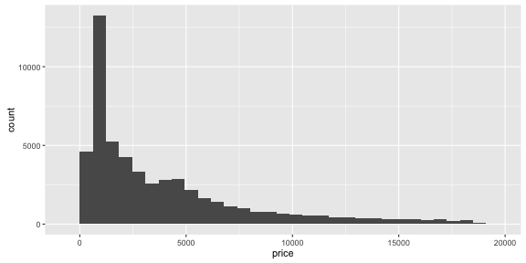 


---

### Gotchas

Easy to run into unhelpful errors


```r
library(ggplot2)
ggplot(airquality) # :(
```

```
## Error: No layers in plot
```

```r
ggplot(airquality, aes(temp)) # :'''(
```

```
## Error: No layers in plot
```

---

### Now make it fancier

Group diamonds by cut.


```r
m <- ggplot(diamonds, aes(price))
m + geom_histogram(aes(fill=cut))
```

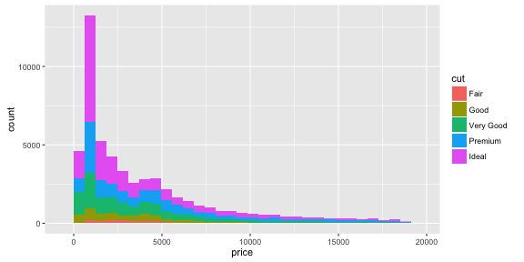 

---

### Facets are an alternative

Group diamonds by cut.


```r
m <- ggplot(diamonds, aes(price))
m + geom_histogram(binwidth=100) + facet_grid(cut~color)
```

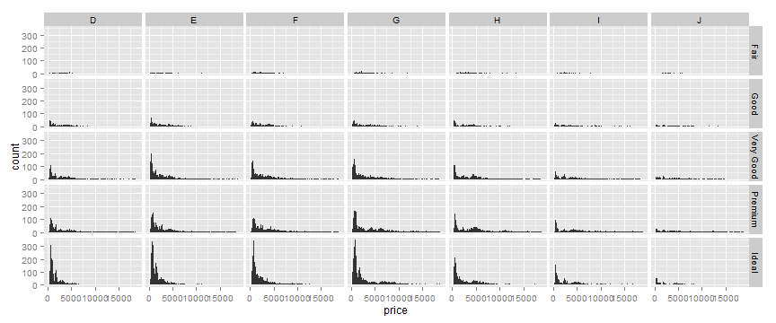 


---
### Let's pause for a moment

+ what's up with `aes`?
+ `aes(x, y, ...)`
+ allows functions of columns e.g. `aes(x=price^2)`, `aes(x=price/carat)`
+ what are layers?

```
m <- ggplot(diamonds, aes(price))
m + geom_histogram(aes(fill=cut))
```

+ note that plots can be built up _incrementally_
+ "Geoms, short for geometric objects, describe the type of plot you will produce."
+ geom names always begin with `geom_`

---
### Scatterplots

Note: There's no "scatterplot" function. Use `geom_point`.


```r
ggplot(diamonds, aes(price, carat)) + geom_point()
```

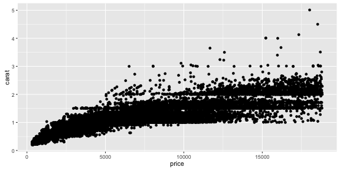 

---
### Log scales


```r
ggplot(diamonds, aes(price, carat)) + geom_point() + scale_x_log10()
```

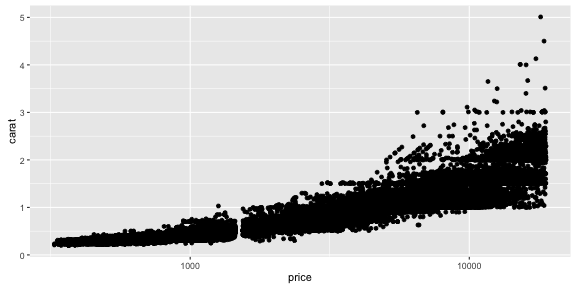 

Scales begin with `scale_`, and are not only for continuous variables: also `datetime`, `shape`, `colour`, etc

---
### Adding factors

Similar to histogram


```r
ggplot(diamonds, aes(price, carat)) + geom_point(aes(colour=color, shape=cut))
```

 

Note the legend for each mapping!

---
### Overview of components

+ `geom_*` : Geoms, short for geometric objects, describe the type of plot you will produce.
+ `stat_*`: Statistical transformations transform your data before plotting
+ `scale_*`: Scales control the mapping between data and aesthetics.
+ `facet_*`: Facets display subsets of the dataset in different panels.
+ `coord_*`: Coordinate systems adjust the mapping from coordinates to the 2d plane of the computer screen.

And a few others...

---
### Problem: overplotting, approach 1a
Try lowering opacity


```r
ggplot(diamonds, aes(price, carat)) + geom_point(alpha=0.1)
```

 


---
### Problem: overplotting, approach 1b

Try mapping the inverse of a variable to opacity.


```r
ggplot(diamonds, aes(price, carat)) + geom_point(aes(alpha=1/carat))
```

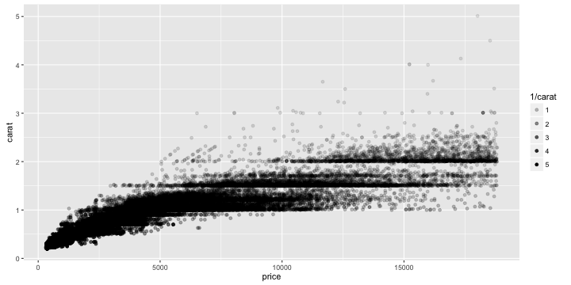 


---
### Problem: overplotting, approach 2

Shake the points around a little bit.


```r
ggplot(diamonds, aes(price, carat)) + geom_jitter()
```

 


---
### Problem: overplotting, approach 3

Bin into hexagons!


```r
library(hexbin)
ggplot(diamonds, aes(price, carat)) + geom_hex()
```

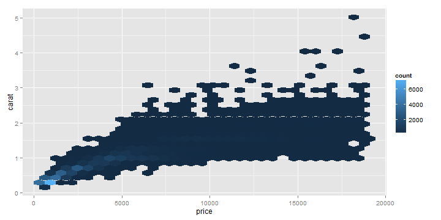 


---
### Problem: overplotting, approach 4

Smooth with a 2d density


```r
ggplot(diamonds, aes(price, carat)) + stat_density2d()
```

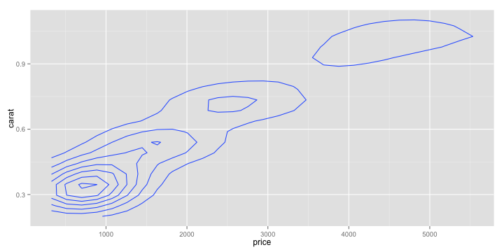 


---
### Something completely different: map!


```r
library(maps)
states <- map_data("state")
ggplot(states) + geom_polygon(aes(x=long, y=lat, group = group), colour="white")
```

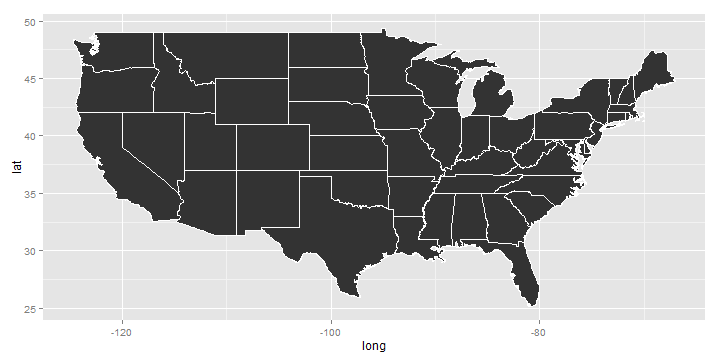 

---
### The world is your oyster


```r
ggplot(map_data("world")) + geom_polygon(aes(x=long, y=lat, group = group), colour="white")
```

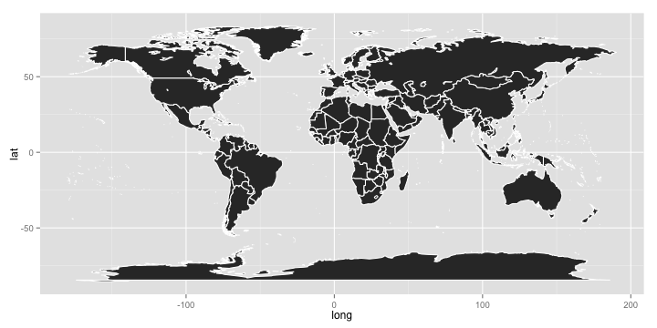 

---
### What's the point?


```r
ucs <- data.frame(lat=c(37.870007, 33.64945), long=c(-122.270501, -117.845707))
m <- ggplot(map_data("state"), aes(x=long, y=lat)) + geom_polygon(aes(group=group))
m + geom_point(data=ucs, colour="red", size=5)
```

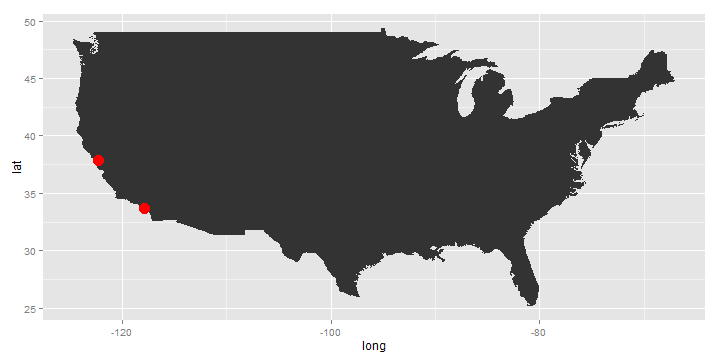 


---
### FYI

+ easy to add legend titles, axis labels, etc
+ `ggsave` function will save the plot to an image (or can just save via Rstudio)
+ `+ theme_bw()` will create a plot more suitable for printing
+ pie charts are possible but please do not make them
+ the `qplot` function is available as a more concise option
+ there are many packages that extend ggplot2's functionality!
+ e.g. `bdscale`, `GGally`, `xkcd`, `ggmap`

---

### Notes on oddities

+ normal R docs are not the best
+ excellent online documentation
+ default theme has grey background
+ uses British English spellings (e.g. "colour")


---

## Exercises: Section 2

+ The exercises are located in section2_exercises.html and the solutions in ex_code.r

+ This set of exercises will focus on data descriptives and data analysis.

---


## Exercise 7. Descriptive plots. 

*Now that we have our dataset in its final form, we can start analyzing it. We will start by simply plotting the data to check for outliers and the distributions of the variables.* 

**7.1** If you haven't already, install and load the package ggplot2. 

**7.2** Generate a histogram plot for each continuous variable (remember to use data_noNA). 

**7.3** Generate a boxplot of mpg by origin to visually check if mpg is different across different countries of origin. Look up how to make a boxplot in the online ggplot2 documentation or type ```?geom_boxplot``` for help. Make sure that your variable on the x-axis (in this case, origin) is a factor (you can type ```class(data_noNA$origin)``` to confirm this; if not refer to Exercise 5).


---

## Exercise 7 (continued)

**7.4** Next we will create a scatterplot of mpg by cylinders and examine the form of the relationship (i.e., is it linear or not?). In other words, we want to decide if we should treat cylinders as a numerical variable (linear) or categorical variable (not linear). Do the following:

* First, create a scatterplot using ```geom_point()```.
* Next, we will add smoothers to the plot. Read the help file for ```stat_smooth()``` and the argument "method". 
* Create two more scatterplots: 
      + One with the default smooth curve overlayed (```method = "auto"```)
      + One with a linear regression fit overlayed (```method = "lm"```)
      
**7.5** Create a scatterplot matrix by applying the function ```pairs()``` to the data.


---

## Exercise 8. Data transformations. 

*Based on the scatterplot matrix from 7.5, we need to transform some of our variables before we can perform a statistical analysis. In particular, we can see that the variance increases as mpg increases, and there are non-linear relationships between mpg and some of the other variables.* 

**8.1** Add the following variables to the dataset: 

* Add log-transformed versions of mpg, horsepower, displacement, and weight. Name them as logmpg, loghorsepower, etc.
      + *Hint*: to add a new variable, assign, for example, ```log(data_noNA$mpg)``` to ```data_noNA$logmpg```. 
* Add a factor version of cylinders. Call it "cylinders_cat". 

**8.2** Look at the data using the ```head()``` function to make sure everything looks good.


---

## Exercise 9. Statistical analysis.

*Now that we have transformed our variables, we can perform statistical analyses to explore the relationship of mpg to other variables.*

**9.1** Let's test whether mean mpg is different across cars of the three origins, using a significance level of 0.05. First, fit a linear regression model for mpg against origin. Then, use both ```anova()``` and ```summary()``` to check the results. 

**9.2** Next, fit a linear regression model predicting mpg. Include all other variables, using only the log-transformed versions if available. Store the model as "model". Then, fit a model using the same predictors, but predict log(mpg). Store the model as "model_log".

**9.3** Apply ```summary()``` to both of the model objects and examine the results. Is origin still helpful in predicting mpg/log(mpg) after including other predictors?


---

## Exercise 9 (continued)


**9.4** What do the numbers in the "Estimate" column in the ```summary()``` output  represent? 

**9.5** Run ```newcase = data_noNA[1:10,]``` to take the first 10 instances, and treat them as new car data for which we want to predict mpg. Use ```predict()``` to predict mpg for them using respectively the object "model" and "model_log". Keep in mind that from "model_log", ```predict()``` returns the predictions for log(mpg) instead of mpg. 


---

## Exercise 10. Bootstrapping. (Optional)

*In this exercise, we will learn the technique of bootstrapping, a general method for determining the variance of a parameter. In particular, we will find an estimate of the variance for the median mpg.*

**10.1** Subset the mpg column of the data and store it as "mpg_data". 

**10.2** Find the median mpg using the function ```median()```. We will eventually work toward finding an estimate for the variance of this parameter. 

**10.3** Sample mpg_data using the function ```sample()```. Store this as an object called "mpg_bootstrap". 

* *Hint*: There are ```length(mpg_data)```= 392 elements in mpg_data. We want to sample mpg_data 392 times (with replacement). Read ```?sample``` if you need help.

**10.4** Find the median of mpg_bootstrap. Store this as an object called "med".  


---

## Exercise 10 (continued)


**10.5** Now, we want to repeat steps 10.3 and 10.4 one thousand times, storing the median of mpg_bootstrap each time. Create a for loop to do this. 

* *Hint*: Begin by creating a NULL vector called med_bootstrap. Within the for loop, include a line of code that concatenates the previous medians ("med_bootstrap") with current median ("med") using the function ```c()```. Store this as "med_bootstrap". 

**10.6** After running your for loop, you should be left with a vector called med_bootstrap that contains 1000 median mpg estimates. Find the variance of this using the function ```var()```. 

---

## Online Resources to Learn R:

> 1. Very useful resources available on **The Comprehensive R Archive Network** (CRAN)
  + please visit: http://cran.us.r-project.org

> 2. R built-in facility:
  + try ?lm, help(lm) in R console

> 3. There are many free tutorials available online:
  + Quick R: http://www.statmethods.net/
  + R-Twotorials: http://www.twotorials.com/
  + UCLA Academy Technology Services: http://www.ats.ucla.edu/stat/r/
  
> 4. R-Bloggers (http://www.r-bloggers.com/): is a central hub (e.g: A blog aggregator) of content collected from bloggers who write about R (in English). 


---

## Useful Books in learning R:

1. Chambers(1998). Programming with Data, Springer.

2. Venables & Ripley (2000). S Programming, Springer.

3. Chambers (2008). Software for Data Analysis, Springer. (highly recommended)

4. More resources available at: http://www.r-project.org/doc/bib/R-books.html

---

## How to get help in R:

1. Simply use the built-in help function in R
  + example: ?lm, help(lm)
  
2. R mailing lists: r-help and r-devel
  + For more info: https://stat.ethz.ch/mailman/listinfo/r-help
  + How to ask good questions: http://www.r-project.org/posting-guide.html

3. Use Q&A websites in particular:
  + stackoverflow (http://stackoverflow.com): for programming related questions.
  + crossValidated (http://stats.stackexchange.com): for Stats related questions.
  
4. Google :)  
