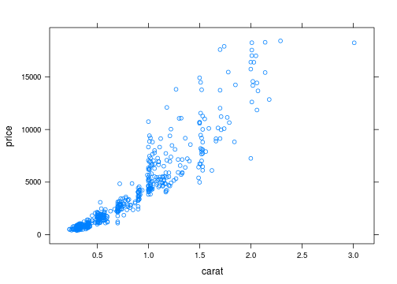
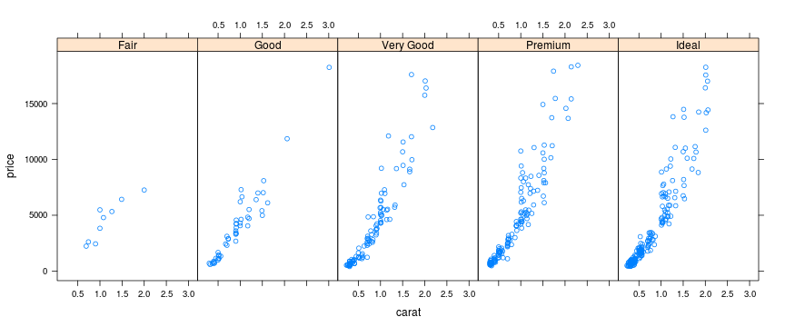
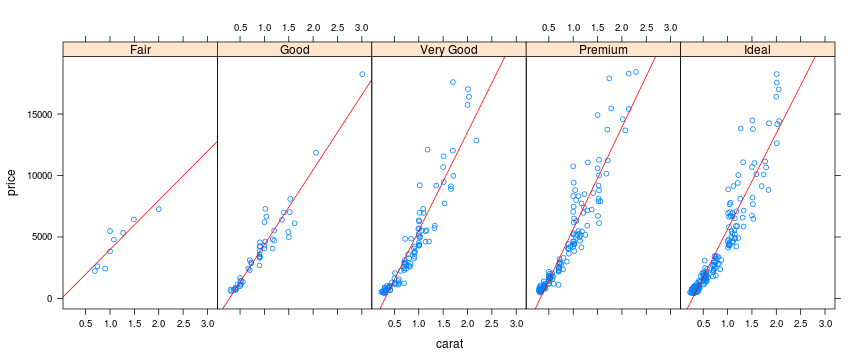
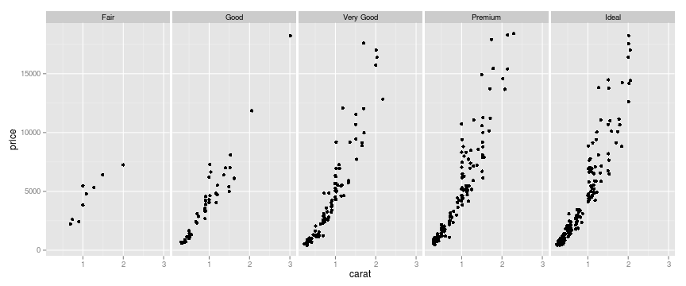
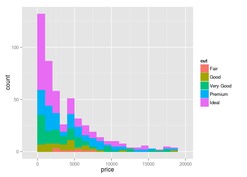
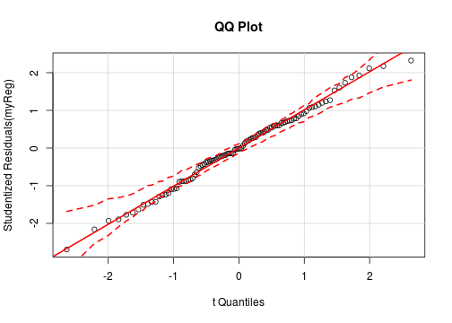

## Introduction


1) The class will include 5 sessions:
  + Session 1 (9-10:20): Data Types in R 
  + Session 2 (10:30-12): Control Structures and Functions
  + Session 3 (12:30-1:50): Statistical Distributions in R
  + Session 4 (2-3:20): Plotting and Data Visualization in R 
  + Session 5 (3:30-5): Statistical Analysis in R

---

## Introduction

2) Each session will include:
  + Lecture: about 1 hr
  + R exercise and Discussion: 20 minutes
  + Break: 10 minutes


3) We are going to work in pairs. Please find a partner. 


4) Feel free to ask questions anytime during lecture.

5) To access this presentation and the codes used during the workshop please visit:
  + https://github.com/SepehrAkhavan/IntroR_Workshop
  + http://sepehrakhavan.github.io/IntroR_Workshop/#1

---

## Session 1 - Agenda

1. Overview and History of R
2. Resources in Learning R and How to get Help?
3. RStudio
4. Data Types in R
5. Subsetting in R


---

## What is R?

+ R is a free software environment for statistical computing and graphics
  + See http://www.r-project.org/ for more info
  
  
+ R compiles and runs on a wide variety of UNIX platforms, Windows and Mac OS

+ R is Open-Source and free

+ R is fundamentally a command-driven system

+ R is an object-oriented programming language 
  + everything in R is considered as an object!


---

## History of R:

+ R created by Ross Ihaka and Robert Gentleman in 1991 in New Zealand
  + For more info please read: Ihaka, Ross, and Robert Gentleman. "R: a language for data analysis and graphics." Journal of computational and graphical statistics 5.3 (1996): 299-314. 

+ In 1996, the first R public mailing lists were created.
  + More info on R mailing lists: http://www.r-project.org/mail.html

+ In 1997, The R core team, with write access to the R source, was formed:
  + More info on the core team: http://www.r-project.org/contributors.html

+ In 2004, the first useR! conference was in Vienna, Austria.

+ In Feb 2011, the first version of RStudio was released.


---

## Online Resources to Learn R:

> 1. Very useful resources available on **The Comprehensive R Archive Network** (CRAN)
  + please visit: http://cran.us.r-project.org

> 2. R built-in facility:
  + try ?lm, help(lm) in R console

> 3. There are many free tutorials available online:
  + Quick R: http://www.statmethods.net/
  + R-Twotorials: http://www.twotorials.com/
  + UCLA Academy Technology Services: http://www.ats.ucla.edu/stat/r/
  
> 4. R-Bloggers (http://www.r-bloggers.com/): is a central hub (e.g: A blog aggregator) of content collected from bloggers who write about R (in English). 


---

## Useful Books in learning R:

1. Chambers(1998). Programming with Data, Springer.

2. Venables & Ripley (2000). S Programming, Springer.

3. Chambers (2008). Software for Data Analysis, Springer. (highly recommended)

4. More resources available at: http://www.r-project.org/doc/bib/R-books.html

---

## How to get help in R:

1. Simply use the built-in help function in R
  + example: ?lm, help(lm)
  
2. R mailing lists: r-help and r-devel
  + For more info: https://stat.ethz.ch/mailman/listinfo/r-help
  + How to ask good questions: http://www.r-project.org/posting-guide.html

3. Use Q&A websites in particular:
  + stackoverflow (http://stackoverflow.com): for programming related questions.
  + crossValidated (http://stats.stackexchange.com): for Stats related questions.
  
4. Google :)  

---

## R Studio:

1. RStudio is a free and open source integrated development environment (IDE) for R.

2. To download RStudio please visit: http://rstudio.org/

3. Please note that you must have R already installed before installing R Studio.

---

## Data Types in R:

1. R has 5 main atomic data types:
  + Numeric
  + Integer
  + Complex
  + Logical
  + Character
  
2. Everything in R is object. Objects can have some attributes.
  + names, dimension, class, length are some possible attributes

---

## Vectors in R:

Vector is the most basic object in R


```r
numVec <- 1:10 # <- : is assigning operator
numVec
```

```
##  [1]  1  2  3  4  5  6  7  8  9 10
```

```r
charVec <- c("a", "b", "c") # c: to combine elements
charVec
```

```
## [1] "a" "b" "c"
```

```r
logVec <- vector(mode = "logical", length = 10)
logVec
```

```
##  [1] FALSE FALSE FALSE FALSE FALSE FALSE FALSE FALSE FALSE FALSE
```

---

### Special Values:

There are some special values in R:
  + use L to refer to an integer value: 1L
  + R knows infinity: Inf, -Inf
  + NaN: refers to "Not a number"
  

```r
intVec <- c(1L, 2L, 3L, 4L) 
intVec
```

```
## [1] 1 2 3 4
```

```r
a <- Inf; b <- 0
rslt <- c(b/a, a/a)
rslt
```

```
## [1]   0 NaN
```

---

### Logical, Complex, & Character Vectors:

Let's see some examples of logical, complex, and character vectors:

```r
logVec <- c(TRUE, FALSE, FALSE, T, F)
logVec
```

```
## [1]  TRUE FALSE FALSE  TRUE FALSE
```

```r
compVec <- c(1 + 0i, 3 + 1i)
compVec
```

```
## [1] 1+0i 3+1i
```

```r
charVec <- c("red", "green", "blue")
charVec
```

```
## [1] "red"   "green" "blue"
```

---

### Data Type Coercion:

+ In general, vectors CAN NOT have mixed types of objects
+ exception: lists in R 


```r
numCharVec <- c(3.14, "a")
numCharVec # ? what would you expect to be printed?

numLogVec <- c(pi, T)
numLogVec # any guess?

charLogVec <- c("a", TRUE)
charLogVec # ?
```

+ In examples above, we saw implicit coercion 
+ Explicit coercion is also possible!

---

### Data Type Coercion:

+ as(): To explicitly coerce objects from one type to another


```r
numVec <- seq(from = 1200, to = 1300, by = 15)
numVec
```

```
## [1] 1200 1215 1230 1245 1260 1275 1290
```

```r
numToChar <- as(numVec, "character")
numToChar
```

```
## [1] "1200" "1215" "1230" "1245" "1260" "1275" "1290"
```

```r
logVec <- c(F, T, F, T, T)
as(logVec, "numeric")
```

```
## [1] 0 1 0 1 1
```

---

### Data Type Coercion:

+ Coercion does not always work! Be careful about warnings:


```r
compVec <- c(12+10i, 1+6i, -3-2i)
as(compVec, "numeric")
```

```
## Warning: imaginary parts discarded in coercion
```

```
## [1] 12  1 -3
```

```r
charVec <- c("2.5", "3", "2.8", "1.5", "zero")
as(charVec, "numeric")
```

```
## Warning: NAs introduced by coercion
```

```
## [1] 2.5 3.0 2.8 1.5  NA
```

---

### Factors:

+ Factor is a vector object used to specify a discrete classification (categorical values).
+ Factors can be: 1) ordered, 2) un-ordered
+ Levels of a Factor are better to be labeled (self-descriptive)
  + Consider gender as (0, 1) as opposed to labeled ("F", "M")

```r
Gender <- rep(c("Female", "Male"), times = 3)
Gender
```

```
## [1] "Female" "Male"   "Female" "Male"   "Female" "Male"
```

```r
GenderFac1 <- factor(Gender)
GenderFac1
```

```
## [1] Female Male   Female Male   Female Male  
## Levels: Female Male
```

---

### Factors:


```r
levels(GenderFac1)
```

```
## [1] "Female" "Male"
```

```r
table(GenderFac1)
```

```
## GenderFac1
## Female   Male 
##      3      3
```

```r
unclass(GenderFac1) # bring the factor down to integer values
```

```
## [1] 1 2 1 2 1 2
## attr(,"levels")
## [1] "Female" "Male"
```

---

### Factors:

```r
GenderFac1 # levels are ordered alphabetically - 1st level = BaseLevel
```

```
## [1] Female Male   Female Male   Female Male  
## Levels: Female Male
```

```r
GenderFac2 <- factor(Gender, levels = c("Male", "Female"))
GenderFac1
```

```
## [1] Female Male   Female Male   Female Male  
## Levels: Female Male
```

```r
GenderFac2
```

```
## [1] Female Male   Female Male   Female Male  
## Levels: Male Female
```

---

### Missing Values:

+ There are two kinds of missing values in R:
  + NaN: refers to "Not a Number" and is a a missing value produced by numerical computation.
  + NA: When a value is "Not Available" or is "Missing", NA is assigned as its value.

+ NaN is also considered as NA (the reverse is NOT true). 

```r
testScore <- NA
is.na(testScore)
```

```
## [1] TRUE
```

```r
is.nan(testScore)
```

```
## [1] FALSE
```

---

### Matrices:

+ Matrix is a special case of vector:
  + Matrix has dimension attribute


```r
myMat <- matrix(nrow = 2, ncol = 4)
myMat
```

```
##      [,1] [,2] [,3] [,4]
## [1,]   NA   NA   NA   NA
## [2,]   NA   NA   NA   NA
```

```r
attributes(myMat)
```

```
## $dim
## [1] 2 4
```

---

### Matrices:

```r
myMat <- matrix(1:8, nrow = 2, ncol = 4)
myMat # matrices are filled in column-wise
```

```
##      [,1] [,2] [,3] [,4]
## [1,]    1    3    5    7
## [2,]    2    4    6    8
```

---

### Matrix is a special vector:


```r
myVec <- 1:8
myVec
```

```
## [1] 1 2 3 4 5 6 7 8
```

```r
dim(myVec) <- c(2,4)
myVec
```

```
##      [,1] [,2] [,3] [,4]
## [1,]    1    3    5    7
## [2,]    2    4    6    8
```

+ Similar to vectors, all elements of a matrix should have the same type.
  + if not, R does an automatic coercion.

---

### Other Ways to Create Matrix:

+ As it's intuitive, matrices seem to be a combination of vectors that are put next to each other (either column wise or row wise).

+ rbind() (row bind) and cbind (column bind) do a similar job:

```r
vec1 <- 1:4
vec2 <- sample(1:100, 4, replace = FALSE)
vec3 <- rnorm(4, mean = 0, sd = 1)
colMat <- cbind(vec1, vec2, vec3)
colMat
```

```
##      vec1 vec2     vec3
## [1,]    1    5  1.44377
## [2,]    2   23  1.27899
## [3,]    3   83  0.04883
## [4,]    4   31 -1.18749
```

---

### Other Ways to Create Matrix:


```r
vec1 <- 1:4
vec2 <- sample(1:100, 4, replace = FALSE)
vec3 <- rnorm(4, mean = 0, sd = 1)
rowMat <- rbind(vec1, vec2, vec3)
rowMat
```

```
##         [,1]   [,2]    [,3]   [,4]
## vec1  1.0000  2.000  3.0000  4.000
## vec2  1.0000 20.000 75.0000 49.000
## vec3 -0.8722 -1.323  0.9648 -1.313
```

---

## Lists:

+ Consider list as a vector but with two main differences:
  + each element of a list can have its own class regardless of other elements
  + This means, each element can be of a different data type and a different length

```r
myVec <- c(10, "R", 10-5i, T)
myList <- list(10, "R", 10-5i, T)
myVec
```

```
## [1] "10"    "R"     "10-5i" "TRUE"
```

---

## Lists:


```r
myList <- list(10, "R", 10-5i, T)
myList
```

```
## [[1]]
## [1] 10
## 
## [[2]]
## [1] "R"
## 
## [[3]]
## [1] 10-5i
## 
## [[4]]
## [1] TRUE
```
+ Elements of list are shown with [[]]
+ Elements of vector are shown with []

---

## Data Frames:

+ We use data frames to store tabular data
+ Data frame is a special list where all objects have equal length
+ The main difference between data.frame and Matrix?

```r
studentID <- paste("S#", sample(c(6473:7392), 10), sep = "")
score <- sample(c(0:100), 10)
gender <- sample(c("female", "male"), 10, replace = TRUE)
data <- data.frame(studentID = studentID, score = score, gender = gender)
head(data)
```

```
##   studentID score gender
## 1    S#6488     7 female
## 2    S#7339    64 female
## 3    S#6486    72   male
## 4    S#6954    25 female
## 5    S#7299    21 female
## 6    S#7056    56 female
```

---

## Exercise 1:

+ a) Create two numeric vectors of the same length and find the product of these two vectors. 

+ b) Create two numeric vectors of DIFFERENT length and find the product of these two vectors. What do you expect to get? Can you explain the output that R generates?

+ c) Create two numeric matrices of 2 by 2 dimensions. 

+ d) Multiply the two matrices in part (c) using * operator

+ e) Multiply the two matrices in part (c) using %*% operator. What is the difference between part (d) and part (e)?

---

## Exercise 2:

+ a) please call help on sample() in R. What does this function do?
+ b) What does replace argument in sample() does?
+ c) Using sample(), randomly choose one number out of the set {1, 2, 3, 4, 5, 6}
+ d) Considering the experiment of rolling a die twice. How can you simulate it by using sample()? what is the role of replace argument in this case?

---

## Subsetting:

+ Often times we need to take a subset of a vector, a matrix, a list, or a dataframe.
+ We consider three main operators to take a subset of an object:
  + [ ]: single brackets return an object of the same class of the original object. By using [], we can also choose more than one element.
  + [[ ]]: double brackets are used primarily for lists and dataframes. 
  + "$": is used primarily for lists and dataframes (similar to double brackets). 

+ With [[ ]] and $, we can only choose one object!

+ [[ ]] and $ can return an object with a different class than the original objects we are subsetting from.

---

### Subsetting examples:


```r
myVec <- 10:20
myVec[3]
```

```
## [1] 12
```

```r
myList <- list(obj1 = "a", obj2 = 10, obj3 = T, obj4 = 10-5i)
myList[[3]]
```

```
## [1] TRUE
```

```r
myList$obj3
```

```
## [1] TRUE
```

---

## Subsetting with [ ]:

+ By using single bracket, we can choose more than one element of an object.
+ In this case, index vectors can be very useful:
  + Index vector is a vector of indices of another vector that is used to select a subset of another vector (or Matrix)
  

```r
x <- seq(from=0, to=100,by=10) # length(x) is ??
IndVec <- c(1, 2, 3, 4, 5) # the first 5 elements 
x[IndVec]
```

```
## [1]  0 10 20 30 40
```

---

## Index Vectors:

+ There are four types of Index vectors:
  1. Logical Index Vector: The logical index vector should be of the same length of the vector from which we are selecting a subset. Values corresponding to TRUE in the index vector are selected.
  2. Vector of Positive integers: All the values in this type of index vector must lie in 1:(length(x)).
  3. Vector of Negative integers: This type of index vector indicates the values to be excluded from the
vector.
  4. A Vector of Character Strings: if a vector has a name attribute, we can simply take a subset of the vector by calling the names of the elements.

---

## Index Vectors:

```r
myVec <- letters[1:10]
names(myVec) <- paste("e", 1:10, sep = "")
myVec
```

```
##  e1  e2  e3  e4  e5  e6  e7  e8  e9 e10 
## "a" "b" "c" "d" "e" "f" "g" "h" "i" "j"
```

```r
logIndVec <- rep(c(T, F), each = 5)
logIndVec
```

```
##  [1]  TRUE  TRUE  TRUE  TRUE  TRUE FALSE FALSE FALSE FALSE FALSE
```

```r
posIndVec <- 1:5
negIndVec <- -6:-10
chIndVec <- c("e1", "e2", "e3", "e4", "e5")
```

---

## Index Vectors:

```r
myVec[logIndVec]
```

```
##  e1  e2  e3  e4  e5 
## "a" "b" "c" "d" "e"
```

```r
myVec[negIndVec]
```

```
##  e1  e2  e3  e4  e5 
## "a" "b" "c" "d" "e"
```

```r
myVec[chIndVec]
```

```
##  e1  e2  e3  e4  e5 
## "a" "b" "c" "d" "e"
```

---

## Logical Index Vectors:

+ logical index vectors can be generated by using conditional statements:
  + Using ==, !=, <, >, ...


```r
myVec <- 1:10
logIndVec <- (myVec < 5)
logIndVec
```

```
##  [1]  TRUE  TRUE  TRUE  TRUE FALSE FALSE FALSE FALSE FALSE FALSE
```

```r
myVec[logIndVec]
```

```
## [1] 1 2 3 4
```

---

## Matrix Indexing:
+ Similar to vector indexing, we can refer to individual elements of a matrix.

```r
myMat <- matrix(1:8, ncol = 4)
myMat
```

```
##      [,1] [,2] [,3] [,4]
## [1,]    1    3    5    7
## [2,]    2    4    6    8
```

```r
myMat[1,1] # refering to an element
```

```
## [1] 1
```

```r
myMat[2,] # refering to the second row
```

```
## [1] 2 4 6 8
```

```r
myMat[,3] # refering to the third column
```

```
## [1] 5 6
```

---

## Matrix Indexing:

+ By default, when the retrieved elements of a matrix look like a vector, R drops their dimension attribute. We can turn this feature off by setting drop = FALSE


```r
myMat[1,1]
```

```
## [1] 1
```

```r
myMat[1,1, drop = FALSE]
```

```
##      [,1]
## [1,]    1
```

```r
myMat[2,, drop = FALSE]
```

```
##      [,1] [,2] [,3] [,4]
## [1,]    2    4    6    8
```

---

## Subsetting Lists:

```r
myList <- list(ch = letters[1:2], lg = F, nm = 1:3)
myList
```

```
## $ch
## [1] "a" "b"
## 
## $lg
## [1] FALSE
## 
## $nm
## [1] 1 2 3
```

```r
myList[1] # subset is still a list
```

```
## $ch
## [1] "a" "b"
```

---

## Subsetting Lists:

```r
myList[1:2] # subset is still a list
```

```
## $ch
## [1] "a" "b"
## 
## $lg
## [1] FALSE
```

```r
myList[[1]] # returning the 1st obj with its own class
```

```
## [1] "a" "b"
```

```r
myList$ch # alternative to [[]]
```

```
## [1] "a" "b"
```

---

## Subsetting Lists:

```r
myList[[1]][2] # returning the 2nd element of the 1st obj
```

```
## [1] "b"
```

```r
myList$ch[2]
```

```
## [1] "b"
```

```r
myList[[c(1,2)]]
```

```
## [1] "b"
```

---

## Subsetting Data Frames:

```r
library(datasets)
data(quakes) # ?quakes for more info
str(quakes)
```

```
## 'data.frame':	1000 obs. of  5 variables:
##  $ lat     : num  -20.4 -20.6 -26 -18 -20.4 ...
##  $ long    : num  182 181 184 182 182 ...
##  $ depth   : int  562 650 42 626 649 195 82 194 211 622 ...
##  $ mag     : num  4.8 4.2 5.4 4.1 4 4 4.8 4.4 4.7 4.3 ...
##  $ stations: int  41 15 43 19 11 12 43 15 35 19 ...
```

```r
head(quakes$long)
```

```
## [1] 181.62 181.03 184.10 181.66 181.96 184.31
```

---

## Subsetting Data Frames:


```r
quakes[1:10,]
```

```
##       lat   long depth mag stations
## 1  -20.42 181.62   562 4.8       41
## 2  -20.62 181.03   650 4.2       15
## 3  -26.00 184.10    42 5.4       43
## 4  -17.97 181.66   626 4.1       19
## 5  -20.42 181.96   649 4.0       11
## 6  -19.68 184.31   195 4.0       12
## 7  -11.70 166.10    82 4.8       43
## 8  -28.11 181.93   194 4.4       15
## 9  -28.74 181.74   211 4.7       35
## 10 -17.47 179.59   622 4.3       19
```

---

## Exercise 3:

+ a) Please run the commands below to load in titanic3 dataset

```r
install.packages("PASWR", repos = "http://cran.stat.ucla.edu") # installs PASWR package
library(PASWR) # this loads in the package
data(titanic3)
```

+ b) print out the top 10 rows of the dataset.

+ c) print out the names of the columns of the dataset
  + hint: use names()

+ d) print the top 10 values of age column

+ e) using is.na() function, take a subset of the dataset that has non-missing age
  + hint: !is.na() refers to NOT NA !

+ e) Run ?which to use help on understanding what which() does.


---

## Time to Break for 10 Minutes :)

---

## Session 2 - Agenda

1. Vectorized Operations in R
2. Reading and Writing in R
3. Control Structure
4. Functions & Packages

---

## Vectorized Operations

R is capable of vectorized operations without any need for running loops:

```r
x <- 1:5
y <- c(1, 2, 6, 7, 10)
x + y # R does an element by element summation
```

```
## [1]  2  4  9 11 15
```

```r
x < y
```

```
## [1] FALSE FALSE  TRUE  TRUE  TRUE
```

---

## Vectorized Operations

+ Similar to vectors, vectorized operations can be performed for Matrices:

```r
x <- matrix(1:9, ncol = 3)
y <- matrix(rep(c(5,6,7), 3), ncol = 3)
x + y # R does an element by element summation
```

```
##      [,1] [,2] [,3]
## [1,]    6    9   12
## [2,]    8   11   14
## [3,]   10   13   16
```

```r
x < y
```

```
##      [,1] [,2]  [,3]
## [1,] TRUE TRUE FALSE
## [2,] TRUE TRUE FALSE
## [3,] TRUE TRUE FALSE
```

---

## Reading and Writing Data

**The slides for "Reading and Writing Data" section were mainly from Dr. Roger D. Peng, Associate Professor at Johns Hopkins**

Main functions for reading data into R:

1. read.table(), read.csv(): to read tabular data 
2. readLines(): to read lines of a text file
3. source(), dget(): reading R codes
4. load(): to read saved workspaces

+ Only read.table() and read.csv() are covered in this lecture. 

---

## Reading and Writing Data

Main functions for writing data from R:

1. write.table(), write.csv(): to write tabular data to file
2. writeLines(): to write lines to a text file
3. dump, dput: to write R codes to a file
4. save: to save a workspace

+ Only write.table() is covered in this lecture. 

---

## read.table():

+ read.table() is the most commonly used function to read data in R. Below are important arguments of this function:

  + file: name or address to the file of interest
  + header: logical indicator on whether the file has header or not
  + sep: string on how columns of data are separated (in .csv, sep = ",")
  + colClasses: is a character vector for class of each column
  + nrows: number of rows in the dataset
  + comment.char: a character that is used in the dataset for commenting
  + skip: number of lines to skip from the beginning of the file
  + stringAsFactors: logical indicator on whether characters should be converted to factors 

+ read.csv() is equivalent to read.table with sep = ","

---

## read.table():


```r
irisFile <- read.table(file = "/Users/sepehrakhavan/Documents/Statistics/Stat Courses/DataScience_Dr.PadhraicSmyth/RWorkShop_Nov_2014/SupportingFiles/iris", header = TRUE)

head(irisFile)
```

```
##   Sepal.Length Sepal.Width Petal.Length Petal.Width Species
## 1          5.1         3.5          1.4         0.2  setosa
## 2          4.9         3.0          1.4         0.2  setosa
## 3          4.7         3.2          1.3         0.2  setosa
## 4          4.6         3.1          1.5         0.2  setosa
## 5          5.0         3.6          1.4         0.2  setosa
## 6          5.4         3.9          1.7         0.4  setosa
```

+ to make read.table() run faster:
  + set comment.char = " "
  + set colClasses upfront

---

## Calculating Memory Requirements:

+ Note that datasets will be read into RAM. So, you should have enough RAM in order to read a dataset. 

+ Consider a data frame with 1.5 million rows and 120 columns. How much memory is required to read this dataset?

1.5m * 120 * 8 bytes/numeric = 1.44 * $10^9$ = 1.44 * $10^9$/ $2^{20}$ MB = 1,373.29 MB = 1.34 GB

+ So it's recommended to have a RAM of size 2 * 1.34GB to read that dataset.

---

## write.table():


```r
write.table(irisFile, file = "path/to/the/file")
```

---

## Loops:

+ There are 3 ways in R to write loops:
  + repeat
  + while
  + for

---

### repeat:

+ The repeat statement causes repeated evaluation of the body until a break is specifically requested.
+ The body of the repeat statement should include:
  + statements to do computation
  + conditions on when to stop


```r
i <- 1 
repeat {
  print(paste("cycle #", i, sep = "")) 
  i=i+1
  if (i >= 2)
  break 
}
```

```
## [1] "cycle #1"
```

---

### while:

+ while loops start by testing a condition. If the condition is true, while executes the body:


```r
i <- 1
while (i < 2) {
  print(paste("cycle #", i, sep = ""))
  i <- i + 1 
}
```

```
## [1] "cycle #1"
```

---

### for:


```r
for(i in 1:4){
  print(paste("cycle #", i, sep = ""))
  i <- i + 1 
}
```

```
## [1] "cycle #1"
## [1] "cycle #2"
## [1] "cycle #3"
## [1] "cycle #4"
```

---

## next:

+ next is useful in skipping an iteration of a loop:

```r
for(i in 1:4){
  if (i == 3){
    next
  }
  print(paste("cycle #", i, sep = ""))
  i <- i + 1 
}
```

```
## [1] "cycle #1"
## [1] "cycle #2"
## [1] "cycle #4"
```


---

## if:

+ if/else statements are used to write conditional statements


```r
x <- 7
if (x < 10){
  print("x is less than 10")
}else{
  print("x is greater than 10")
}
```

```
## [1] "x is less than 10"
```

---

## if:

```r
age <- sample(1:100, 10)
ageCat <- rep(NA, length(age))
for (i in 1:(length(age))) {
    if (age[i] <= 35){
       ageCat[i] <- "Young"
      }else if (age[i] <= 55){
        ageCat[i] <- "Middle-Aged"
      }else{
         ageCat[i] <- "Old"
      } 
}
age.df <- data.frame(age = age, ageCat = ageCat)
age.df[1:3,]
```

```
##   age ageCat
## 1  72    Old
## 2  79    Old
## 3  96    Old
```

---

## Functions and Packages:

1. R language has many built-in functions
2. Each function has a name followed by ()
3. Arguments of a function should mention within parentheses
4. R packages are a comfortable way to maintain collections of R functions and data sets
5. Packages allow for easy, transparent and cross-platform extension of the R base system


---

## Functions and Packages:

There are some terms which sometimes get confused and should be clarified:

1. Package: An extension of the R base system with code, data and documentation in a standardized format
2. Library: A directory containing installed packages
3. Repository: A website providing packages for installation
4. Source: The original version of a package with human-readable text and code
5. Binary: A compiled version of a package with computer-readable text and code, may work only on a specific platform
6. Base packages: Part of the R source tree, maintained by R Core

+ for more info on how R packages are developed, please read: "Creating R Packages: A Tutorial" (Friedrich Leisch)
  + http://cran.r-project.org/doc/contrib/Leisch-CreatingPackages.pdf


---

## How to install a package in R:

There are two ways to install a package in R:

1. Installing from CRAN: install a package directly from the repository
  + Using R studio: tools/install packages
  + From R console: install.packages()

2. Installing from Source: In this method, you should first download the add-on R package and use the following unix command in the console to install the package:
  + R CMD INSTALL packageName -l path/to/your/Rpackage/Directory

+ Once you install a package, you need to load it into R using the function library()


---

## Exercise 4:

+ Please install ggplot2 package
+ Once installed, please load the package


---

## Calling a function in R


```r
str(sample)
```

```
## function (x, size, replace = FALSE, prob = NULL)
```
+ consider sample() in R. Simply run ?sample in R console to read the help on this function.
+ sample() gets four arguments: 
  + x: sample space in form of a vector
  + size: your desired sample size
  + replace: sampling with/without replacement
  + prob: a vector of probability weights

+ some of the arguments have default values. What are those arguments?

+ How to use (or call) this function? 


---

## Calling a function in R


```r
# Functions arguments can be matched: 1) by position or 2) by name
sampSpace <- 1:6 # rolling a die
sample(sampSpace, 1) # arguments with default values can be omitted
```

```
## [1] 5
```

```r
sample(size = 1, x = sampSpace) # no need to remember the order 
```

```
## [1] 1
```

```r
sample(size = 1, sampSpace)
```

```
## [1] 2
```


---

## Writing your Own functions


```r
yourFnName <- function(<your arguments>){
  # body of your code
  
  # return the output of the function
}

# to use your function, you can simply call the function name as:
yourFnName(<set values for the input arguments>)
```


---

## Writing your Own functions

+ Let's write a function that gets three arguments: a, b, c
+ The function then returns min of these two numbers


```r
myMin <- function(a, b, c){
  myMinVal <- min(a, b, c)
  return(myMinVal)
}

myMin(10, 20, 30)
```

```
## [1] 10
```

```r
myMin(10, NA, 20) # ? how to fix this so it returns 10
```

```
## [1] NA
```


---

## Writing a function for 2-sample t-test

```r
myTtest <- function(vec1, vec2) {
    # my T-Test function / Assuming constant variance + Two-Sided T Test
    n1 <- length(vec1)
    n2 <- length(vec2)
    miu1 <- mean(vec1)
    miu2 <- mean(vec2)
    var1 <- var(vec1)
    var2 <- var(vec2)
    pooledVar <- ((n1 - 1) * (var1) + (n2 - 1) * (var2))/(n1 + n2 - 2)
    testStat <- (miu1 - miu2)/(sqrt(pooledVar * (1/n1 + 1/n2)))
    df <- n1 + n2 - 2
    pval <- 2 * pt(abs(testStat), df, lower.tail = FALSE)
    rslt <- c(`Mean of Vec1` = miu1, `Mean of Vec2` = miu2, testStat = testStat,
        df = df, pval = pval)
    return(rslt)
}
```


---

## Writing a function for 2-sample t-test

```r
y1 <- rnorm(10, mean = 0, sd = 1); y2 <- rnorm(10, mean = 0, sd = 1)
myTtest(y1, y2)
```

```
## Mean of Vec1 Mean of Vec2     testStat           df         pval 
##    0.2885997    0.1261674    0.3712788   18.0000000    0.7147639
```

```r
# Using R's built-in T-Test:
# t.test(y1, y2, var.equal = TRUE)  # ? Test this on your own!
```


---

## Some notes on Functions

> 1. Variables defined within a function are locally defined (i.e. not defined outside of the function).

> 2. Functions in R are treated like any other first class objects. This means functions can be an passed as arguments of other functions.

> 3. Arguments of functions are evaluated as they are needed (lazy evaluation). 

> 4. " ... " can be an argument of a function and it refers to a situation where number of input arguments can be varied and is not fixed upfront. 


---

## Lazy Evaluation of Function Arguments


```r
myLazyFn1 <- function(a, b){
  return(a)
}
myLazyFn1(10) # No error!
```

```
## [1] 10
```

```r
myLazyFn2 <- function(a, b){
  print(a)
  print(b)
  return(1)
}
myLazyFn2(10) # No error!
```

```
## [1] 10
```

```
## Error in print(b): argument "b" is missing, with no default
```


---

## Some useful functions:

+ Here we are going to talk about:
  + str(): a function to explain internal structure of a function
  + apply(): to apply a function to a matrix or dataframe
  + lapply(), sapply(), tapply(), mapply(): applying a function to a vector
  + split(): to split a dataset by levels of a factor


---

### str():

+ str() is a compact way of understanding what an object is and what is in that object.

```r
str(str)
```

```
## function (object, ...)
```

```r
str(sample)
```

```
## function (x, size, replace = FALSE, prob = NULL)
```

```r
genderF <- factor(sample(c("Male", "Female"), 20, replace = TRUE))
str(genderF)
```

```
##  Factor w/ 2 levels "Female","Male": 1 1 1 2 1 1 1 1 1 2 ...
```


---

### str():

```r
myMat <- matrix(1:10, ncol = 5)
str(myMat)
```

```
##  int [1:2, 1:5] 1 2 3 4 5 6 7 8 9 10
```

```r
myList <- list(numVec = 1:3, logVec = F, charVec = LETTERS[1:4])
str(myList)
```

```
## List of 3
##  $ numVec : int [1:3] 1 2 3
##  $ logVec : logi FALSE
##  $ charVec: chr [1:4] "A" "B" "C" "D"
```


---

### apply():


```r
str(apply) # try ?apply for more info
```

```
## function (X, MARGIN, FUN, ...)
```

+ apply() is a useful function to apply a function (FUN) on a MARGIN of a matrix or dataframe (X)

+ MARGIN: a vector giving the subscripts which the function will be applied over
  + 1: indicates rows
  + 2: indicates columns
  + c(1, 2): indicates rows and columns

+ FUN: refers to the function that we want to apply on the dataset

+ "..." : additional arguments of FUN


---

### apply():


```r
myMat <- matrix(1:10, ncol = 5)
myMat[2,c(2, 5)] <- NA
myMat
```

```
##      [,1] [,2] [,3] [,4] [,5]
## [1,]    1    3    5    7    9
## [2,]    2   NA    6    8   NA
```

```r
apply(myMat, 2, sum, na.rm = TRUE)
```

```
## [1]  3  3 11 15  9
```


---

### apply():


```r
# consider iris dataset: 
head(iris) # more info ?iris
```

```
##   Sepal.Length Sepal.Width Petal.Length Petal.Width Species
## 1          5.1         3.5          1.4         0.2  setosa
## 2          4.9         3.0          1.4         0.2  setosa
## 3          4.7         3.2          1.3         0.2  setosa
## 4          4.6         3.1          1.5         0.2  setosa
## 5          5.0         3.6          1.4         0.2  setosa
## 6          5.4         3.9          1.7         0.4  setosa
```

```r
# suppose we are interested in getting 25% and 75% of each numeric column
```


---

### apply():


```r
# Consider iris dataset: 
apply(iris[,-5], 2, quantile, probs = c(0.25, 0.75))
```

```
##     Sepal.Length Sepal.Width Petal.Length Petal.Width
## 25%          5.1         2.8          1.6         0.3
## 75%          6.4         3.3          5.1         1.8
```


---

### lapply() and sapply():


```r
str(lapply)
```

```
## function (X, FUN, ...)
```

```r
str(sapply)
```

```
## function (X, FUN, ..., simplify = TRUE, USE.NAMES = TRUE)
```
+ x: a list, dataframe, or a vector
+ FUN: the function to be applied to each element of X
+ "...": other arguments of FUN


---

### lapply() and sapply():

```r
myList <- list(e1 = 1:10, e2 = -1:-10)
lapply(myList, mean)
```

```
## $e1
## [1] 5.5
## 
## $e2
## [1] -5.5
```

```r
sapply(myList, mean)
```

```
##   e1   e2 
##  5.5 -5.5
```


---

### lapply() v. sapply()?:

+ sapply() simplfies the result of lapply.
  
+ If the result of lapply is a list with all elements of the same length:
    + if length == 1: sapply() returns a vector
    + if length != 1: sapply() returns a matrix
    
+ otherwise, sapply() generates a list similar to lapply()


---

### lapply() & sapply() with a user-defined FUN

```r
myList <- list(e1 = 1:10, e2 = -1:-10)
lapply(myList, function(element){return(mean(c(element[1], element[length(element)])))})
```

```
## $e1
## [1] 5.5
## 
## $e2
## [1] -5.5
```

```r
sapply(myList, function(element){return(mean(c(element[1], element[length(element)])))})
```

```
##   e1   e2 
##  5.5 -5.5
```


---

### tapply():

```r
str(tapply)
```

```
## function (X, INDEX, FUN = NULL, ..., simplify = TRUE)
```

+ tapply() applies a function on a subset of of a vector
+ X: is a vector 
+ INDEX: list of one or more factors, each of same length as X
+ FUN: our function of interest
+ "...": other arguments of FUN
+ simplify: any guess???


---

### tapply():

```r
HeightDF <- data.frame(heigth = c(rnorm(100, 180, 3), rnorm(100, 170, 3)), gender = factor(rep(c("M", "F"), each = 100)))
head(HeightDF)
```

```
##     heigth gender
## 1 180.1205      M
## 2 177.6105      M
## 3 182.3793      M
## 4 174.8602      M
## 5 176.5579      M
## 6 174.9129      M
```

```r
tapply(HeightDF$heigth, HeightDF$gender, mean)
```

```
##        F        M 
## 169.9085 179.8410
```


---

### mapply():

```r
str(mapply)
```

```
## function (FUN, ..., MoreArgs = NULL, SIMPLIFY = TRUE, USE.NAMES = TRUE)
```
  
+ all previous "apply" functions were univariate
  + f(x, {some other parameters})
  
+ What to do if we want to apply a multivariate function:
  + f(x, y, {some other parameters}) # we can have more than 2 variables 


---

### mapply():

```r
l1 <- list(e1 = 1:10, e2 = 1:10)
l2 <- list(e1 = -1:-10, e2 = -1:-10)
# how to get l1$e1[i] + l1$e2[i] + l2$e1[i] + l2$e2[i] ? 
mapply(sum, l1$e1, l1$e2, l2$e1, l2$e2)
```

```
##  [1] 0 0 0 0 0 0 0 0 0 0
```


---

### split():

```r
str(split) # ?split for more info
```

```
## function (x, f, drop = FALSE, ...)
```

+ X: a vector or a data frame
+ f: factor
+ drop: should R drop empty factor levels?


---

### split():

```r
str(HeightDF)
```

```
## 'data.frame':	200 obs. of  2 variables:
##  $ heigth: num  180 178 182 175 177 ...
##  $ gender: Factor w/ 2 levels "F","M": 2 2 2 2 2 2 2 2 2 2 ...
```

```r
# Goal: to separate Females from Males
splitData <- split(HeightDF$heigth, HeightDF$gender)
str(splitData)
```

```
## List of 2
##  $ F: num [1:100] 172 171 166 169 175 ...
##  $ M: num [1:100] 180 178 182 175 177 ...
```


---

## Exercise 5:
+ Load in diamonds dataset in R

```r
# How to load in the dataset?
library(ggplot2)
data(diamonds) # more info on the data: ?diamonds
```
+ Find average diamond price per each cut quality level
+ Find 2.5 and 97.5 percentile of diamond price per each cut quality level 
+ Split the dataset based on cut quality level 

---

## Time for Lunch Break for 30 Minutes. Please come back at 12:30 :)

---

## Session 3 - Agenda

1. Useful Matrix Functions
2. Statistical Distributions in R
3. Exercise

---

## Useful Matrix Functions

Consider matrix "A". We can then have:
> 1. t(A): transpose of A
> 2. solve(): to get inverse of A
> 3. eigen(): to get eigen values and eigen vectors (if A is symmetric)
> 4. We only cover solve() in this lecture

---

### solve():
+ Consider B = A %*% X (where X is an unknown matrix)
+ Then: X = solve(A, B)
+ In a special case where B = I, X = $A^{-1}$


```r
A <- matrix(c(1, 2, 3, 2, 4, 5, 3, 5, 6), ncol = 3)
A
```

```
##      [,1] [,2] [,3]
## [1,]    1    2    3
## [2,]    2    4    5
## [3,]    3    5    6
```

```r
# to get inverse of A: solve(A)
```

---

### solve():

```r
solve(A)
```

```
##      [,1] [,2] [,3]
## [1,]    1   -3    2
## [2,]   -3    3   -1
## [3,]    2   -1    0
```

```r
# To check that solve(A) is inverse of A:
solve(A)%*%A
```

```
##      [,1] [,2]          [,3]
## [1,]    1    0  0.000000e+00
## [2,]    0    1 -8.881784e-16
## [3,]    0    0  1.000000e+00
```
+ Machine epsilon is defined to be the smallest positive number which, when added to 1, gives a number different from 1.
+ Please visit http://en.wikipedia.org/wiki/Machine_epsilon for more info

---

## Statistical Distributions in R:

+ R has many in-built statistical distributions
  + examples: binomial, poisson, normal, chi square, ...

+ Each distribution in R has four functions:
  + these functions beging with a "d", "p", "q", or "r" and followed by the name of the distribution

+ ddist(parameters): refers to the density of each distribution
+ rdist(parameters): generates random numbers out of each distribution
+ qdist(parameters): to get quantile of a distribution
+ pdist(parameters): to calculate CDF


---

### Example of a Discrete Distribution:

```r
# Consider tossing a coin 10 times
str(dbinom)
```

```
## function (x, size, prob, log = FALSE)
```

```r
dbinom(5, 10, 0.5) # prob of getting two head
```

```
## [1] 0.2460938
```

```r
str(pbinom) # cumulative dist
```

```
## function (q, size, prob, lower.tail = TRUE, log.p = FALSE)
```

```r
pbinom(5, 10, 0.5) # Pr[X <= 5]
```

```
## [1] 0.6230469
```


---

### Example of a Discrete Distribution:

```r
str(qbinom) # quantile: Pr[X <= ?] = known value
```

```
## function (p, size, prob, lower.tail = TRUE, log.p = FALSE)
```

```r
qbinom(0.6230, 10, 0.5) # prob of getting two head
```

```
## [1] 5
```

```r
str(rbinom) # Generating random numbers
```

```
## function (n, size, prob)
```

```r
rbinom(20, 10, 0.5) # Pr[X <= 5]
```

```
##  [1] 5 4 4 6 6 5 3 5 5 6 7 4 5 4 6 4 3 6 5 5
```


---

### Example of a Continuous Distribution:

```r
# Consider a standard Normal distribution
str(dnorm)
```

```
## function (x, mean = 0, sd = 1, log = FALSE)
```

```r
dnorm(x = 0, mean = 0, sd = 1, log = FALSE)
```

```
## [1] 0.3989423
```

```r
str(pnorm) # cumulative dist
```

```
## function (q, mean = 0, sd = 1, lower.tail = TRUE, log.p = FALSE)
```

```r
pnorm(0, mean = 0, sd = 1)
```

```
## [1] 0.5
```


---

### Example of a Continuous Distribution:

```r
str(qnorm) # quantile
```

```
## function (p, mean = 0, sd = 1, lower.tail = TRUE, log.p = FALSE)
```

```r
qnorm(0.5, mean = 0, sd = 1)
```

```
## [1] 0
```

```r
str(pnorm) # cumulative dist
```

```
## function (q, mean = 0, sd = 1, lower.tail = TRUE, log.p = FALSE)
```

```r
rnorm(10, mean = 0, sd = 1)
```

```
##  [1] -1.6828068 -0.4316023  0.5722818  0.3030231  0.5682190 -0.3344771
##  [7] -0.1360782  2.1635574  0.5146324 -0.8512698
```


---

### Example of a Continuous Distribution:

```r
# Let's try plotting Normal curve (more on plotting later)
x <- seq(from = -3, to = 3, by = 0.05)
y <- dnorm(x, mean = 0, sd = 1)
plot(x, y, type = "l")
```


---

## Session 4 - Agenda

+ Goal: use gglot2 to explore data afterwards
+ Emphasize simple examples
+ Emphasize principles
+ Some examples will be developed today
+ ... but there's a lot that won't be covered

---

### Information Visualization

+ Efficiency
+ Interpretability
+ Parsimony
+ ggplto2 lies in "sweet spot" of functionality

---

### Hello, ggplot2

+ ggplot2 is a very popular graphics system written by Hadley Wickham
+ implementation of Leland Wilkinson' Grammar of Graphics
+ I'll use the `diamonds` dataset for most of the examples.


```r
head(diamonds)
```

```
##   carat       cut color clarity depth table price    x    y    z
## 1  0.23     Ideal     E     SI2  61.5    55   326 3.95 3.98 2.43
## 2  0.21   Premium     E     SI1  59.8    61   326 3.89 3.84 2.31
## 3  0.23      Good     E     VS1  56.9    65   327 4.05 4.07 2.31
## 4  0.29   Premium     I     VS2  62.4    58   334 4.20 4.23 2.63
## 5  0.31      Good     J     SI2  63.3    58   335 4.34 4.35 2.75
## 6  0.24 Very Good     J    VVS2  62.8    57   336 3.94 3.96 2.48
```

---

### First ggplot2: histogram

Let's make a histogram!


```r
ggplot(diamonds, aes(price)) + geom_histogram()
```

```
## stat_bin: binwidth defaulted to range/30. Use 'binwidth = x' to adjust this.
```

 


---

### Gotchas

Easy to run into unhelpful errors


```r
library(ggplot2)
ggplot(airquality) # :(
```

```
## Error: No layers in plot
```

```r
ggplot(airquality, aes(temp)) # :'''(
```

```
## Error: No layers in plot
```


---

### Now make it fancier

Group diamonds by cut.


```r
m <- ggplot(diamonds, aes(price))
m + geom_histogram(aes(fill=cut))
```

```
## stat_bin: binwidth defaulted to range/30. Use 'binwidth = x' to adjust this.
```

 

---

### Facets are an alternative

Group diamonds by cut.


```r
m <- ggplot(diamonds, aes(price))
m + geom_histogram(binwidth=100) + facet_grid(cut~color)
```

 


---
### Let's pause for a moment

+ what's up with `aes`?
+ `aes(x, y, ...)`
+ allows functions of columns e.g. `aes(x=price^2)`, `aes(x=price/carat)`
+ what are layers?

```
m <- ggplot(diamonds, aes(price))
m + geom_histogram(aes(fill=cut))
```

+ note that plots can be built up _incrementally_
+ "Geoms, short for geometric objects, describe the type of plot you will produce."
+ geom names always begin with `geom_`

---
### Scatterplots

Note: There's no "scatterplot" function. Use `geom_point`.


```r
ggplot(diamonds, aes(price, carat)) + geom_point()
```

 

---
### Log scales


```r
ggplot(diamonds, aes(price, carat)) + geom_point() + scale_x_log10()
```

 

Scales begin with `scale_`, and are not only for continuous variables: also `datetime`, `shape`, `colour`, etc

---
### Adding factors

Similar to histogram


```r
ggplot(diamonds, aes(price, carat)) + geom_point(aes(colour=color, shape=cut))
```

 

Note the legend for each mapping!


---
### Problem: overplotting, approach 1a
Try lowering opacity


```r
ggplot(diamonds, aes(price, carat)) + geom_point(alpha=0.1)
```

 


---
### Problem: overplotting, approach 1b

Try mapping the inverse of a variable to opacity.


```r
ggplot(diamonds, aes(price, carat)) + geom_point(aes(alpha=1/carat))
```

 


---
### Problem: overplotting, approach 2

Shake the points around a little bit.


```r
ggplot(diamonds, aes(price, carat)) + geom_jitter()
```

 


---
### Problem: overplotting, approach 3

Bin into hexagons!


```r
library(hexbin)
ggplot(diamonds, aes(price, carat)) + geom_hex()
```

 


---
### Problem: overplotting, approach 4

Smooth with a 2d density


```r
ggplot(diamonds, aes(price, carat)) + stat_density2d()
```

 


---
### Something completely different: map!


```r
library(maps)
states <- map_data("state")
ggplot(states) + geom_polygon(aes(x=long, y=lat, group = group), colour="white")
```

 

---
### The world is your oyster


```r
ggplot(map_data("world")) + geom_polygon(aes(x=long, y=lat, group = group), colour="white")
```

 

---
### What's the point?


```r
ucs <- data.frame(lat=c(37.870007, 33.64945), long=c(-122.270501, -117.845707))
m <- ggplot(map_data("state"), aes(x=long, y=lat)) + geom_polygon(aes(group=group))
m + geom_point(data=ucs, colour="red", size=5)
```

 


---
### FYI

+ easy to add legend titles, axis labels, etc
+ `ggsave` function will save the plot to an image (or can just save via Rstudio)
+ `+ theme_bw()` will create a plot more suitable for printing
+ pie charts are possible but please do not make them
+ the `qplot` function is available as a more concise option
+ there are many packages that extend ggplot2's functionality!
+ e.g. `bdscale`, `GGally`, `xkcd`, `ggmap`

---

### Notes on oddities

+ normal R docs are not the best
+ excellent online documentation
+ default theme has grey background
+ uses British English spellings (e.g. "colour")


---

## Exercise 6:
### Source: Dr. Stacey Hancock, Dept. Statistics - UCI
+ Suppose 20 people go to a fancy restaurant. Each person is wearing a hat and checks his/her hat at the door as he/she arrives. The hat-check attendant gets tipsy throughout the evening, forgetting which hat belongs to whom, and returns a random hat to each person as they leave. The patrons leave in a random order.

+ Conduct a simulation in R to answer the following question:
  + estimate the probability that at least one patron gets his or her own hat back
  + calculate the empirical mean (average) number of patrons who get their own hats back.
  


---

## Exercise 7: 
### Source: Dr. Stacey Hancock, Dept. Statistics - UCI
+  Write an R function that will simulate rolling two k-sided dice (each numbered 1, 2, 3,...., k) N times, and return the proportion of times your sum was greater than or equal to 7. 
+ Set the function's default value for k to 6 and the default value for N to 1000. 


---

## Time for Lunch Break for 10 Minutes :)

---

## Session 4 - Agenda

1. Plotting Systems in R
2. Preparing Data for ggplot2
3. ggplot2 simple examples
4. ggplot2 philosophy
5. more interesting ggplot2 examples

---

## Plotting Systems in R

There are three popular plotting systems in R:
  + Base Plotting System (bultin to R)
  + Lattice
  + ggplot2

We'll focus entirely on ggplot2.

---

### Base System

Ugly, but easy to use and always available.


```r
hist(rnorm(100,4,20))
```


---

### Hello, ggplot2

+ ggplot2 is a very popular graphics system written by Hadley Wickham
+ implementation of Leland Wilkinson' Grammar of Graphics

----

### Preliminary: reshape2

+ data must have right "shape" before plotting
+ + (although this is very useful tool to have, generally)
+ just 2 functions: `melt` and `cast`
+ `melt` turns wide data into long data
+ `cast` turns long data


---

### Example: airquality


```r
names(airquality) <- tolower(names(airquality))
head(airquality)
```

```
##   ozone solar.r wind temp month day
## 1    41     190  7.4   67     5   1
## 2    36     118  8.0   72     5   2
## 3    12     149 12.6   74     5   3
## 4    18     313 11.5   62     5   4
## 5    NA      NA 14.3   56     5   5
## 6    28      NA 14.9   66     5   6
```

```r
# vs. 
head(melt(airquality))
```

```
## No id variables; using all as measure variables
```

```
##   variable value
## 1    ozone    41
## 2    ozone    36
## 3    ozone    12
## 4    ozone    18
## 5    ozone    NA
## 6    ozone    28
```

```r
# vs.
head(melt(airquality, id.vars = c("month", "day")))
```

```
##   month day variable value
## 1     5   1    ozone    41
## 2     5   2    ozone    36
## 3     5   3    ozone    12
## 4     5   4    ozone    18
## 5     5   5    ozone    NA
## 6     5   6    ozone    28
```


---

## Exercise 8:
### Source: Dr. Stacey Hancock, Dept. Statistics - UCI 
+ 1) In this Exercise, we explore a famour theorem in Statistics known as "The Central Limit Theorem".
+ 2) Choose a probability distribution other than the normal distribution from which to generate data.
+ 3) Generate 1000 random values from your chosen distribution. Create a histogram of these 1000 values with a density plot overlaid.
+ 4) Generate 1000 random samples of size n = 5 from your chosen distribution (use a for loop!). For each sample, calculate the sample mean (using the "mean" function in R), so in the end, you have a vector of 1000 sample means. Create a histogram of these 1000 sample means with a density plot overlaid.
+ 5) Can you re-write step (4) in terms of a function with with sample size as an input argument? Run your function with different n (10, 20 , 30). 
+ 6) As n increases, what happens to the shape of the histogram?


---


## Graphics Devices in R

+ Graphics devices are places where plots in R appear:
  + screen device
  + file device

+ Screen Devices:
  + quartz() (Mac OS), x11() (Unix/Linux), windows() (Windows)

+ File Devices:
  + pdf(), png(), svg(), ...
  
+ By default, plots are sent to the screen device
  
+ for more info, please see ?Devices

---

## Graphics Devices in R

+ There is nothing special to do to use the screen device
+ For file devices:
  + Graphics device of interest should be opened
  + Plotting codes
  + closing the device using dev.off()


```r
x <- rnorm(100)
pdf(file = "path/to/file.pdf")
hist(x)
dev.off()
```

---

## File Devices

+ File devices are in two main types:
  + Vector formats: pdf(), svg(), postscript()
  + Bitmap formats: png(), jpeg(), bmp()


---

## Lattice Plotting System
+ In Lattice plotting system, plotting is a one-step process with a single function call
+ Important functions:
  + xyplot(): to create scatterplot
  + bwplot(): to create boxplot
  + histogram()
  + stripplot(): boxplot with overlaid data points


---

### Lattice Scatter plot

```r
library(lattice)
data(diamonds)
diamonds_subset <- diamonds[sample(1:nrow(diamonds),500),]
xyplot(price ~ carat, data = diamonds_subset)
```




---

### Lattice Scatterplot across 

```r
xyplot(price ~ carat | cut, data = diamonds_subset, layout = c(5,1))
```




---

### Lattice Scatterplot with Linear fit

```r
xyplot(price ~ carat | cut, panel = function(x, y, ...){
  panel.xyplot(x, y, ...) # Here we call the default panel function
  panel.lmline(x, y, col = "red") # We overlay lm fit
}, data = diamonds_subset, layout = c(5,1))
```




---

## ggplot2
+ As Hadley Wickham explained in his ggplot2 book: ggplot2 is a package to "shorten the distance from mind to page"
+ Here we briefly mention some examples. For more information please visit: http://ggplot2.org
+ We focus on qplot() function to:
  + create scatter plot
  + create histogram


---

### qplot()
+ qplot() stands for quick plot
+ it's analogous to plot() in the base package
+ main elements of each plot are:
  + aesthetics: refers to size, shape, color, ...
  + geoms: refers to points, lines, bars, ...
  + for a complete list of aesthetics and geoms as well as other elements, please visit: http://docs.ggplot2.org/current/  
  

---

### qplot() - Scatterplot

```r
library(ggplot2)
qplot(carat, price, data = diamonds_subset)
```


  

---

### qplot() - Scatterplot

```r
qplot(carat, price, data = diamonds_subset, col = cut)
```


  

---

### qplot() - Facets

```r
qplot(carat, price, data = diamonds_subset, facets = . ~ cut) # rows ~ columns
```



  

---

### qplot() - Histogram

```r
qplot(price, data = diamonds_subset, fill = cut, binwidth = 1000)
```




---

## Time for Lunch Break for 10 Minutes :)


---

## Session 5 - Agenda

1. T-Test in R
2. ANOVA in R
3. Linear Regression in R


---

## T-Test in R

T-tests can be categorized into two groups:
  + 1) One-Sample t-test
  + 2) two-sample t-test


---

###  One-Sample T-Test

```r
oneSampData <- rnorm(100, mean = 0, sd = 1)
oneSampTest.0 <- t.test(oneSampData) # ?t.test
oneSampTest.0
```

```
## 
## 	One Sample t-test
## 
## data:  oneSampData
## t = -1.085, df = 99, p-value = 0.2808
## alternative hypothesis: true mean is not equal to 0
## 95 percent confidence interval:
##  -0.32600  0.09558
## sample estimates:
## mean of x 
##   -0.1152
```


---

###  One-Sample T-Test

```r
names(oneSampTest.0) # alternative to names()?? 
```

```
## [1] "statistic"   "parameter"   "p.value"     "conf.int"    "estimate"   
## [6] "null.value"  "alternative" "method"      "data.name"
```


---

###  Two-Sample T-Test
Two sample t-tests are categorized into 3 groups:
  + T-Test with equal variances
  + T-Test with un-equal variances
  + Paired T-Test: can be also considered as one-sample t-test on deltas.


---

###  Two-Sample T-Test (Un-equal Variances)

```r
Samp1 <- rnorm(30, mean = 2.5, sd = 1)
Samp2 <- rnorm(50, mean = 5.5, sd = 1)
t.test(Samp1, Samp2)  # default assump: unequal variances
```

```
## 
## 	Welch Two Sample t-test
## 
## data:  Samp1 and Samp2
## t = -12.96, df = 63.2, p-value < 2.2e-16
## alternative hypothesis: true difference in means is not equal to 0
## 95 percent confidence interval:
##  -3.430 -2.514
## sample estimates:
## mean of x mean of y 
##     2.605     5.576
```


---

###  Two-Sample T-Test (Equal Variances)

```r
t.test(Samp1, Samp2, var.equal = TRUE)  # default assump: unequal variances
```

```
## 
## 	Two Sample t-test
## 
## data:  Samp1 and Samp2
## t = -12.83, df = 78, p-value < 2.2e-16
## alternative hypothesis: true difference in means is not equal to 0
## 95 percent confidence interval:
##  -3.433 -2.510
## sample estimates:
## mean of x mean of y 
##     2.605     5.576
```


---

###  Two-Sample T-Test (Paired T Test)

```r
t.test(Samp1, Samp2[1:30], paired = TRUE)  # default assumption: unequal variances
```

```
## 
## 	Paired t-test
## 
## data:  Samp1 and Samp2[1:30]
## t = -9.487, df = 29, p-value = 2.148e-10
## alternative hypothesis: true difference in means is not equal to 0
## 95 percent confidence interval:
##  -3.479 -2.245
## sample estimates:
## mean of the differences 
##                  -2.862
```


---

##  ANOVA
If you are not familiar with ANOVA, simply consider ANOVA as an extension to two-sample t-test where we have more than two groups.


```r
Samp1 <- round(rnorm(10, mean = 25, sd = 1), 1)
Samp2 <- round(rnorm(10, mean = 30, sd = 1), 1)
Samp3 <- round(rnorm(10, mean = 35, sd = 1), 1)
myDF <- data.frame(y = c(Samp1, Samp2, Samp3), group = rep(c(1, 2, 3), each = 10))
myDF$group <- as.factor(myDF$group)
str(myDF)
```

```
## 'data.frame':	30 obs. of  2 variables:
##  $ y    : num  25 24.7 24.9 26 27.7 23.7 23.8 25 25.5 26.2 ...
##  $ group: Factor w/ 3 levels "1","2","3": 1 1 1 1 1 1 1 1 1 1 ...
```


---

##  ANOVA

```r
ANOVAfit <- lm(y ~ group, data = myDF)  # instead of lm, aov() can also be used!
myANOVA <- anova(ANOVAfit)  # anova computes analysis of variance tables on a fitted model object.
str(myANOVA) # see what is 
```

```
## Classes 'anova' and 'data.frame':	2 obs. of  5 variables:
##  $ Df     : int  2 27
##  $ Sum Sq : num  428.9 32.4
##  $ Mean Sq: num  214.4 1.2
##  $ F value: num  179 NA
##  $ Pr(>F) : num  2.69e-16 NA
##  - attr(*, "heading")= chr  "Analysis of Variance Table\n" "Response: y"
```


---

##  ANOVA
+ To learn more on how to fit ANOVA, please visit: 
  + http://www.statmethods.net/stats/anova.html
  

---

##  Linear Regression:
+ lm() is used to fit linear regression
+ Here we use "Prestige" dataset from "car" package

```r
# install.package("car")
library(car)
data(Prestige) # load the data
str(Prestige)
```

```
## 'data.frame':	102 obs. of  6 variables:
##  $ education: num  13.1 12.3 12.8 11.4 14.6 ...
##  $ income   : int  12351 25879 9271 8865 8403 11030 8258 14163 11377 11023 ...
##  $ women    : num  11.16 4.02 15.7 9.11 11.68 ...
##  $ prestige : num  68.8 69.1 63.4 56.8 73.5 77.6 72.6 78.1 73.1 68.8 ...
##  $ census   : int  1113 1130 1171 1175 2111 2113 2133 2141 2143 2153 ...
##  $ type     : Factor w/ 3 levels "bc","prof","wc": 2 2 2 2 2 2 2 2 2 2 ...
```
  

---

###  Linear Regression - Fit:

```r
myReg <- lm(prestige ~ education + income + women, data = Prestige)
myReg # summary(myReg)
```

```
## 
## Call:
## lm(formula = prestige ~ education + income + women, data = Prestige)
## 
## Coefficients:
## (Intercept)    education       income        women  
##    -6.79433      4.18664      0.00131     -0.00891
```

```r
names(myReg)
```

```
##  [1] "coefficients"  "residuals"     "effects"       "rank"         
##  [5] "fitted.values" "assign"        "qr"            "df.residual"  
##  [9] "xlevels"       "call"          "terms"         "model"
```
  

---

###  Linear Regression - Fit:

```r
head(myReg$fitted.values)
```

```
##  gov.administrators    general.managers         accountants 
##               64.22               78.49               58.71 
## purchasing.officers            chemists          physicists 
##               52.58               65.35               73.13
```

```r
head(myReg$residuals) # y - y.hat
```

```
##  gov.administrators    general.managers         accountants 
##               4.583              -9.392               4.693 
## purchasing.officers            chemists          physicists 
##               4.219               8.152               4.472
```
  

---

##  Linear Regression - Diagnostics:
+ Here we cover some common regression diagnostics including:
  + Testing for Normality
  + Testing for Constant Variance
  
+ Reference: http://www.statmethods.net/stats/rdiagnostics.html
  

---

###  Testing for Normality


```r
qqPlot(myReg, main = "QQ Plot")
```

 
  

---

###  Testing for Constant Variance


```r
spreadLevelPlot(myReg)
```

 
  

---

###  Exercise 9:

+ For this exercise, we need to load in diamonds datset from ggplot2 package.
+ Is ther any difference between diamonds with different quality of cut in terms of price? 
  + You will need to use ANOVA to answer this question
+ Fit a linear regression to predict price of a given diamond based on the features below:
  + carat, cut, color, clarity, and depth
  
